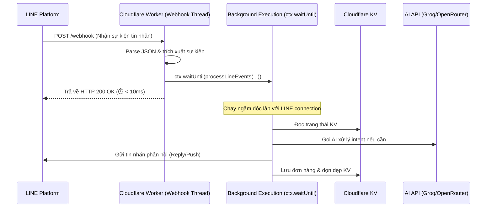

# PDP: Nhiệm vụ 2.3 - Tách luồng Webhook Bất Đồng Bộ (Sửa lỗi timeout 2s của LINE)

Tài liệu này chi tiết hóa thiết kế kỹ thuật của **Task 3** trong kế hoạch khắc phục lỗi trễ và mất phản hồi của Webhook LINE. Mục tiêu cốt lõi là giải phóng hoàn toàn Webhook HTTP Response bằng cách trả về mã trạng thái HTTP 200 OK ngay lập tức (< 10ms), đồng thời chuyển toàn bộ xử lý tin nhắn chạy ngầm trong `ctx.waitUntil()`.

---

## 1. Mục tiêu & Phạm vi

### Mục tiêu
* **Khắc phục triệt để lỗi timeout 2s**: LINE Platform yêu cầu server phản hồi webhook HTTP 2xx trong tối đa 2 giây. Việc chuyển sang kiến trúc bất đồng bộ (Asynchronous processing) giúp thời gian phản hồi HTTP của Worker luôn < 10ms, loại bỏ hoàn toàn lỗi timeout của LINE.
* **Loại bỏ sự cố lặp tin nhắn (Retry Storm)**: Khi LINE nhận được 200 OK ngay lập tức, LINE sẽ dừng cơ chế auto-retry, từ đó tránh việc server bị spam trùng lặp tin nhắn và xử lý AI lặp đi lặp lại.
* **Đảm bảo Context Alive**: Tận dụng cơ chế `ctx.waitUntil()` của Cloudflare Workers để giữ cho tiến trình ngầm không bị ngắt kết nối trước khi hoàn tất nhiệm vụ (gọi AI, gửi tin nhắn, ghi dữ liệu).

### Phạm vi ảnh hưởng
* **Backend**: Sửa đổi cấu trúc nhận webhook chính trong file [line.ts](file:///Users/duc.cao/Documents/learning/benmi-order/benmi-worker-official/src/modules/line.ts#L211-L553).

---

## 2. Chi tiết Thiết kế Kỹ thuật

### 2.1 Sơ đồ tuần tự của Luồng xử lý mới (Sequence Diagram)



### 2.2 Mã nguồn đề xuất thay thế trong `src/modules/line.ts`

Chúng ta tách hàm `handleLineWebhook` thành hai phần: hàm tiếp nhận chính trả về 200 OK nhanh, và hàm xử lý ngầm `processLineEvents`.

```typescript
// Webhook endpoint chính
export async function handleLineWebhook(request: Request, env: Env, ctx: ExecutionContext): Promise<Response> {
  let body: any = {};
  try {
    body = await request.json();
  } catch (e) {
    console.error("[Benmi] handleLineWebhook: Invalid JSON body received");
    return new Response("Invalid JSON", { status: 400, headers: corsHeaders() });
  }

  const events = Array.isArray(body.events) ? body.events : [];

  if (events.length > 0 && ctx && ctx.waitUntil) {
    // Đẩy xử lý sự kiện vào chạy ngầm để giải phóng connection ngay lập tức
    ctx.waitUntil((async () => {
      try {
        await processLineEvents(events, env, ctx);
      } catch (err: any) {
        console.error("[Benmi] Error processing webhook events in background:", err.message);
      }
    })());
  }

  // Luôn trả về 200 OK cho LINE trong < 10ms để tránh timeout
  return new Response("OK", { status: 200, headers: corsHeaders() });
}

// Hàm xử lý nghiệp vụ chạy ngầm trong background
async function processLineEvents(events: any[], env: Env, ctx: ExecutionContext): Promise<void> {
  for (const event of events) {
    if (!event || event.type !== "message") continue;
    const message = event.message || {};
    if (message.type !== "text") continue;

    const replyToken = event.replyToken;
    const source = event.source || {};
    const userId = source.userId;
    if (!userId) continue;

    const userText = message.text || "";
    
    // Logic xử lý tin nhắn cũ từ dòng 226 của line.ts sẽ được chuyển vào đây...
  }
}
```

---

## 3. Kế hoạch Triển khai & Kiểm thử

### Các bước thực hiện
1. Thay đổi định nghĩa hàm `handleLineWebhook` trong [line.ts](file:///Users/duc.cao/Documents/learning/benmi-order/benmi-worker-official/src/modules/line.ts) để trả về phản hồi 200 OK ngay lập tức.
2. Bao bọc toàn bộ logic nghiệp vụ xử lý tin nhắn vào hàm ngầm `processLineEvents`.
3. Kiểm tra biến `ctx` và lệnh `ctx.waitUntil` để đảm bảo không bị lỗi undefined khi chạy trên môi trường local dev của Wrangler.

### Kiểm thử thủ công
1. Chạy `npx wrangler dev` tại máy local.
2. Gửi một request giả lập webhook bằng `curl` đến endpoint webhook cục bộ:
   ```bash
   curl -X POST http://localhost:8787/webhook \
     -H "Content-Type: application/json" \
     -d '{"events": [{"type": "message", "replyToken": "testToken", "source": {"userId": "U123456"}, "message": {"type": "text", "text": "營業時間"}}]}'
   ```
3. Xác minh xem lệnh curl có trả về kết quả `OK` ngay lập tức (< 20ms) trong khi terminal của Wrangler vẫn đang in log chạy ngầm hay không.
