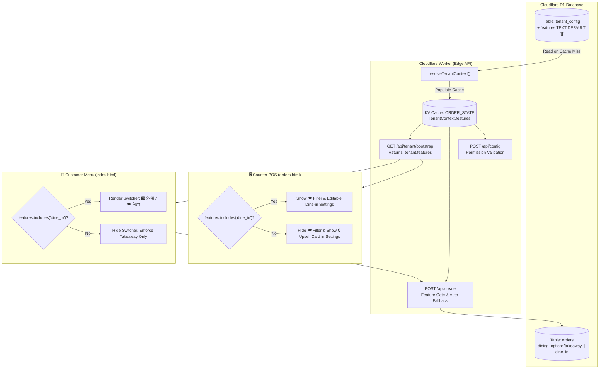

# Principal Design Proposal (PDP)
# PDP: Tenant Feature Packaging & Modular Subscription Add-ons [New]

**Document Identifier**: `PDP-2026-FEAT-PKG-001`  
**Author**: Principal Engineer  
**Status**: Proposed (Aligned via `/grill-me`)  
**Target Systems**: `benmi-worker-official` (Cloudflare Worker & D1), `orders.html` (Counter POS Dashboard), `index.html` (Customer Menu LIFF)

---

## 1. Executive Summary & Objectives

### 1.1. Problem Statement
The BLAB Multi-tenant ordering platform currently operates on a monolithic capability model where all active tenants have access to identical feature sets. As we build advanced commercial modules (commencing with **Dine-in / Ăn tại quán (`dine_in`)**, and expanding to Cloud Thermal Printing, Table QR Ordering, Real-time Inventory/Stock Depletion, and Advanced Financial Analytics), the platform lacks a robust **Tenant-level Feature Packaging & Commercialization Engine**. 

We need a lightweight, ultra-low-latency mechanism to govern feature access per tenant without adding database query overhead or breaking backwards compatibility for legacy tenants.

### 1.2. Goals (In-Scope)
- **Modular Feature Enablement**: Support granular, per-tenant feature gating via `features: string[]` (e.g. `["dine_in"]`).
- **Zero Regression / Full Backwards Compatibility**: All legacy features (Online Menu, Takeaway Ordering, Real-time POS Dashboard, LINE Alerts) remain default capabilities (Base Tier) for all tenants with zero disruption.
- **Zero Latency Impact**: Feature flags must be resolved within the existing KV Tenant Cache (`tenant:<tenant_id>:config_cache`) and bootstrap payload, preserving sub-millisecond edge resolution.
- **Graceful Customer Fallback**: If an order payload requests a gated capability (`dining_option: "dine_in"`) on an unsubscribed tenant, the backend must transparently fall back to `takeaway` without dropping the customer's order.
- **Upsell & Locked POS UX**: In the Counter POS Dashboard (`orders.html`), unsubscribed features must present an informative locked state (🔒 icon, feature description, and direct contact button to BLAB Support for plan upgrades).
- **Staging Dual-Tenant Verification**: Enable `["dine_in"]` on tenant `benmi` while leaving tenant `zhadan` (or `test-basic`) on `[]` to prove comparative isolation.

### 1.3. Non-Goals (Out-of-Scope)
- Automated Stripe/Credit Card billing gateway integration (feature provisioning is managed via BLAB admin/database update for this phase).
- Time-based automatic trial expiration cron jobs (reserved for future automated subscription lifecycle PDP).

---

## 2. Context & Current Architecture

### 2.1. Current Architecture Flow
1. **Tenant Resolution**: When a client accesses the app, [`resolveTenantContext`](file:///Users/duccao/Documents/benmi-order/benmi-worker-official/src/modules/tenant.ts#L7-L59) checks Cloudflare KV cache (`ORDER_STATE`). On a cache miss, it reads D1 table `tenant_config` and caches the `TenantContext` for 300s.
2. **Client Bootstrap**: The client calls `GET /api/tenant/bootstrap?tenant_id=<id>`, handled by [`handleTenantBootstrap`](file:///Users/duccao/Documents/benmi-order/benmi-worker-official/src/modules/bootstrap.ts#L10-L100), returning branding, operating hours, and configuration flags.
3. **Order Ingestion**: Client submits orders via `POST /api/create`, processed by [`createOrder`](file:///Users/duccao/Documents/benmi-order/benmi-worker-official/src/modules/orders.ts#L330-L420) and stored in D1 table `orders`.

### 2.2. Current Limitation
The `tenant_config` table contains business configuration (`allow_dine_in`, `allow_scheduled_pickup`), but lacks a permission/subscription tier barrier. Any tenant could toggle `allow_dine_in: true` regardless of whether they have purchased the Dine-in module.

---

## 3. Proposed Architecture



### 3.1. Data Models & Schema Updates

#### Database Schema: `migrations/0023_add_tenant_features.sql`
```sql
-- Migration: 0023_add_tenant_features.sql
-- Description: Add features column to tenant_config for modular subscription add-ons

ALTER TABLE tenant_config ADD COLUMN features TEXT DEFAULT '[]';

-- Initialize existing tenants with empty array (all legacy features remain active by default)
UPDATE tenant_config SET features = '[]' WHERE features IS NULL;
```

#### TypeScript Types: `benmi-worker-official/src/types/tenant.ts`
```typescript
export interface TenantContext {
  tenantId: string;
  // LINE Integration
  lineChannelToken: string;
  lineChannelSecret: string | null;
  liffId: string;
  liffUrl: string;
  // AI Integration
  groqApiKey: string | null;
  groqModel: string;
  openrouterApiKey: string | null;
  openrouterModel: string;
  // Branding
  brandName: string;
  brandSubtitle?: string | null;
  brandColor: string;
  logoUrl?: string | null;
  storeAddress: string | null;
  // Business Config
  operatingHours: string | null;
  deliveryPolicy: string | null;
  allowScheduledPickup?: boolean;
  allowDineIn?: boolean;
  storeStatus?: 'open' | 'busy' | 'paused';
  quickReplies: QuickReply[];
  defaultPassword: string;
  locale: string;
  // Google Sheets
  googleSheetsUrl: string | null;
  // Subscription & Packaging Features
  features: string[];
}

export function tenantHasFeature(ctx: TenantContext | null | undefined, featureKey: string): boolean {
  if (!ctx || !Array.isArray(ctx.features)) return false;
  return ctx.features.includes(featureKey);
}
```

### 3.2. API Payloads & Contracts

#### 1. Bootstrap Response (`GET /api/tenant/bootstrap?tenant_id=<id>`)
```json
{
  "tenant": {
    "id": "benmi",
    "brandName": "Benmi 越式法國麵包",
    "allowScheduledPickup": true,
    "allowDineIn": true,
    "storeStatus": "open",
    "features": ["dine_in"],
    "liffId": "2009555608-DMioljsI"
  },
  "catalog": [ ... ],
  "modifiers": [ ... ]
}
```

#### 2. Order Creation Ingestion (`POST /api/create`)
If a client sends `dining_option: "dine_in"` for a tenant whose `features` does not contain `"dine_in"`, the backend automatically overrides:
```typescript
if (body.dining_option === 'dine_in' && !tenantHasFeature(tenantCtx, 'dine_in')) {
  console.warn(`[Orders] Tenant '${tenantCtx.tenantId}' lacks 'dine_in' feature. Auto-fallback to 'takeaway'.`);
  body.dining_option = 'takeaway';
}
```

---

## 4. Migration & Rollout Strategy

### 4.1. Rollout Phases
```
Phase 1: Database Migration (Add `features` column to `tenant_config` with default '[]')
   │
   ▼
Phase 2: Edge Worker Engine (Deploy TenantResolver, Bootstrap & Order Gate logic)
   │
   ▼
Phase 3: Client Frontend Deployment (Update `orders.html` Upsell UI & `index.html` gating)
   │
   ▼
Phase 4: Comparative Staging Seed (`benmi` -> ["dine_in"], `zhadan` -> [])
   │
   ▼
Phase 5: Production Rollout & Tenant Provisioning
```

### 4.2. Zero-Downtime Guarantee
1. The column `features` defaults to `'[]'`. When parsed, an empty array cleanly falls back to Base Tier capabilities.
2. In-flight requests or older cached tenant objects without `features` default to `features = []` via null-coalescing (`row.features ? JSON.parse(row.features) : []`), preventing runtime `TypeError`.

### 4.3. Rollback Plan
If an unexpected edge condition arises:
- **Fast Rollback (Worker)**: Re-deploy previous Worker version ID via `wrangler deploy` (takes < 3 seconds).
- **Database Rollback**: Revert `features` values to `[]` or drop column if necessary. Existing orders remain unaffected since `dining_option` column is preserved.

---

## 5. Alternatives Considered & Trade-offs

| Strategy | Pros | Cons | Decision |
| :--- | :--- | :--- | :--- |
| **A. Modular Add-ons (`features: ["dine_in", ...]`)** | • Highly extensible<br>• Zero schema changes for future modules<br>• Fast JSON array check in memory | • Requires JSON parsing in worker (negligible ~0.01ms) | **Selected** (Recommended) |
| **B. Fixed Tiers (`plan: 'standard' \| 'pro'`)** | • Simple single string column | • Rigid: Cannot mix and match individual add-ons (e.g. A store wants Cloud Printer but not Dine-in) | Rejected |
| **C. Relational Table (`tenant_features`)** | • Strict normalization | • Requires additional `JOIN` or extra D1 query on cache miss, increasing edge latency | Rejected |

---

## 6. Cross-Cutting Concerns

### 6.1. Security & Privilege Escalation Prevention
- An unsubscribed tenant cannot force Dine-in mode by calling `POST /api/config` with `{ allowDineIn: true }`. The endpoint checks `tenantHasFeature(ctx, 'dine_in')` and returns an error or ignores the flag.
- Tampering with client-side JavaScript or crafted `POST /api/create` requests will be caught by the server-side validator and sanitized to `takeaway`.

### 6.2. Observability & Telemetry
- Structured logging on feature checks:
  ```json
  {
    "level": "warn",
    "event": "feature_gate_fallback",
    "tenant_id": "zhadan",
    "requested_feature": "dine_in",
    "action": "fallback_to_takeaway"
  }
  ```
- Prometheus/Cloudflare Analytics metrics on `feature_usage_total{tenant_id="benmi", feature="dine_in"}`.

### 6.3. Performance & Memory
- JSON parsing of `row.features` happens only during tenant cache population (once every 5 minutes per edge POP). Cached objects in KV retain the parsed `features: string[]` for 0ms runtime deserialization.

---

## 7. Step-by-Step Execution Plan

### Milestone 1: Database Migration & Cloudflare Worker Core
- [x] Create migration [`migrations/0023_add_tenant_features.sql`](file:///Users/duccao/Documents/benmi-order/benmi-worker-official/migrations/0023_add_tenant_features.sql).
- [ ] Update [`src/types/tenant.ts`](file:///Users/duccao/Documents/benmi-order/benmi-worker-official/src/types/tenant.ts) with `features: string[]` and `tenantHasFeature()`.
- [ ] Update [`src/modules/tenant.ts`](file:///Users/duccao/Documents/benmi-order/benmi-worker-official/src/modules/tenant.ts) to parse and cache `features`.
- [ ] Update [`src/modules/bootstrap.ts`](file:///Users/duccao/Documents/benmi-order/benmi-worker-official/src/modules/bootstrap.ts) to expose `tenant.features`.
- [ ] Update [`src/modules/orders.ts`](file:///Users/duccao/Documents/benmi-order/benmi-worker-official/src/modules/orders.ts) to enforce auto-fallback on `createOrder`.
- [ ] Update [`src/modules/config.ts`](file:///Users/duccao/Documents/benmi-order/benmi-worker-official/src/modules/config.ts) to guard `allowDineIn` changes.
- [ ] Run `npx tsc --noEmit` to verify type safety.

### Milestone 2: Customer Menu Frontend Gating
- [ ] In [`index.html`](file:///Users/duccao/Documents/benmi-order/index.html): Check `tenant.features.includes('dine_in')` in `applyPickupConfig()`.
- [ ] If not enabled, hide `#dining-option-wrapper` and `#checkout-dining-option-group`, locking choice to Takeaway.

### Milestone 3: POS Dashboard Gating & Upsell UX
- [ ] In [`js/orders-i18n.js`](file:///Users/duccao/Documents/benmi-order/js/orders-i18n.js): Add multilingual translations for locked feature banner (`featureLockedTitle`, `featureLockedDesc`, `btnContactUpgrade`).
- [ ] In [`js/orders-settings.js`](file:///Users/duccao/Documents/benmi-order/js/orders-settings.js): Render locked upsell state with 🔒 icon if `dine_in` feature is absent.
- [ ] In [`js/orders-live.js`](file:///Users/duccao/Documents/benmi-order/js/orders-live.js): Hide `[🍽️ 內用]` filter button if `dine_in` is absent.

### Milestone 4: Staging Dual-Tenant Comparative Testing
- [ ] Apply migration `0023` to `blab-db-test`.
- [ ] Seed `benmi`: `features = '["dine_in"]'`.
- [ ] Seed `zhadan`: `features = '[]'`.
- [ ] Deploy worker to staging (`platform-worker-staging`).
- [ ] Execute comparative E2E testing across both tenants.

---

## 8. Verification & Test Plan

### 8.1. Automated Verification
```bash
# Type check worker codebase
cd benmi-worker-official && npx tsc --noEmit
```

### 8.2. Live Staging Test Suite (Comparative Matrix)

| Test ID | Target Tenant | Feature Gating | Expected Menu Result | Expected POS Result | Expected API Result |
| :--- | :--- | :--- | :--- | :--- | :--- |
| **TC-01** | `benmi` | `features: ["dine_in"]` | Shows `🛍️ 外帶` vs `🍽️ 內用` switcher; can submit `dine_in` order. | Full POS access; filter tab `[🍽️ 內用]` visible; Settings card editable. | `POST /api/create` creates order with `dining_option: "dine_in"`. |
| **TC-02** | `zhadan` | `features: []` | No switcher displayed; 100% locked to Takeaway. | Filter tab `[🍽️ 內用]` hidden; Settings card shows 🔒 Locked Upsell UI. | `POST /api/create` with `dining_option: "dine_in"` is auto-fallback to `takeaway`. |

---
*End of Principal Design Proposal.*
