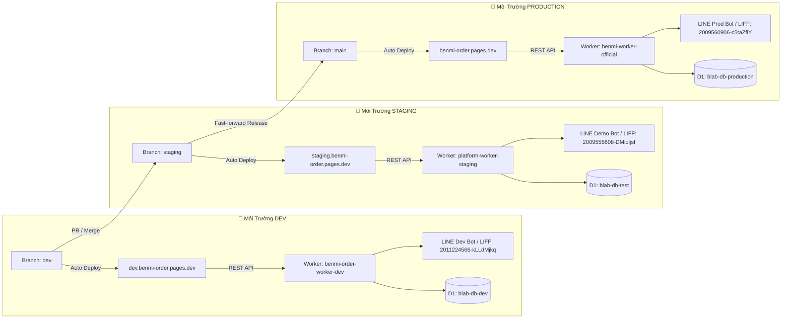
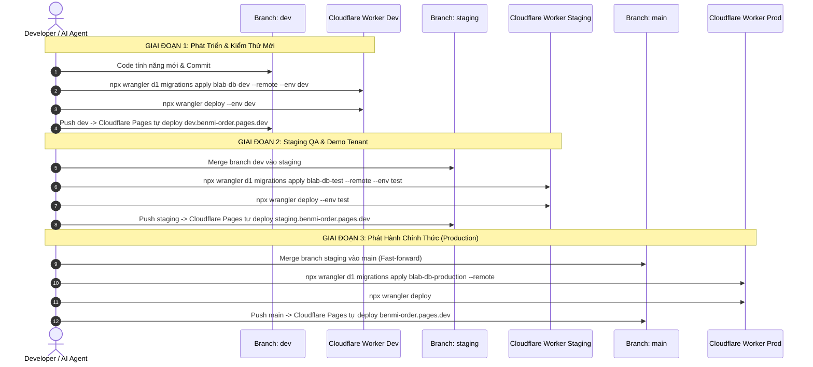

# PDP: Kiến Trúc 3 Môi Trường Độc Lập (Dev -> Staging -> Production)

## 1. Tóm Tắt Tổng Quan & Mục Tiêu (Executive Summary & Objectives)

### Bối Cảnh & Vấn Đề (Problem Statement)
Hiện tại dự án Benmi Order đang vận hành theo mô hình 2 môi trường: **Staging** (`blab-db-test`, `platform-worker-staging`) và **Production** (`blab-db-production`, `benmi-worker-official`). 
Khi nền tảng mở rộng quy mô, môi trường Staging phải gánh đồng thời 2 vai trò:
1. **Kiểm thử tính năng mới đang phát triển (R&D / QA)**: Thường xuyên bị thay đổi schema, dữ liệu thử nghiệm, tính năng chưa ổn định.
2. **Demo cho khách hàng / Tenant mới (Business / Sales)**: Cần một môi trường ổn định, dữ liệu menu mẫu đẹp mắt, không bị gián đoạn hoặc gặp lỗi bất ngờ trong quá trình chào hàng / demo ký hợp đồng.

### Mục Tiêu Đạt Được (Goals - In-Scope)
- Thiết lập quy trình phân tầng 3 môi trường biệt lập hoàn toàn từ mã nguồn, CSDL, KV Cache đến tài khoản LINE Bot & LIFF:
  1. **DEV**: Nơi lập trình, thử nghiệm tính năng mới trên Cloud.
  2. **STAGING**: Nơi kiểm thử tính năng hoàn thiện và cung cấp môi trường Demo trực tiếp cho các đối tác / quán mới.
  3. **PRODUCTION**: Nơi phục vụ chính thức các quán đã ký hợp đồng vận hành thương mại.
- Cấu hình hạ tầng Cloudflare Worker, Cloudflare D1 (`blab-db-dev`), Cloudflare KV, LINE Channel Access Token và LIFF App riêng biệt cho DEV.
- Cập nhật cơ chế nhận diện tự động `WORKER_BASE` và fallback `LIFF_ID` trên Frontend.
- Thiết lập quy trình Git workflow chuẩn: `dev -> staging -> main`.

---

## 2. Bảng Ma Trận So Sánh 3 Môi Trường (Environment Matrix)

| Thông Số / Thành Phần | 🧪 DEV (Development) | 🎪 STAGING (Demo & QA) | 🚀 PRODUCTION (Live) |
| :--- | :--- | :--- | :--- |
| **Mục đích sử dụng** | Thử nghiệm tính năng mới, R&D | Kiểm thử hoàn thiện & Demo cho quán mới | Vận hành kinh doanh thực tế |
| **Git Branch** | `dev` | `staging` | `main` |
| **Cloudflare Pages Frontend** | `dev.benmi-order.pages.dev` | `staging.benmi-order.pages.dev` | `benmi-order.pages.dev` |
| **Cloudflare Worker URL** | `https://benmi-order-worker-dev.thuanmnc.workers.dev` | `https://platform-worker-staging.thuanmnc.workers.dev` | `https://benmi-worker-official.thuanmnc.workers.dev` |
| **Cloudflare D1 Database** | `blab-db-dev` (`40b67d8a-29e0-40c1-9ce2-b76f76864e95`) | `blab-db-test` (`c0152835-7d42-4545-8cb4-6658dfc7e97d`) | `blab-db-production` (`48479f91-eec7-4da2-b044-edaaf622f195`) |
| **Cloudflare KV Namespace** | `ad5b1e14aad4486fb2ffcd9961cadf3a` (`ORDER_STATE`) | `ad5b1e14aad4486fb2ffcd9961cadf3a` (`ORDER_STATE`) | `4800c4ce106043de89baa2aa7a7676b0` (`ORDER_STATE`) |
| **Fallback LIFF ID** | `2011224566-kLLdMjkq` | `2009555608-DMioljsI` | `2009560906-c5taZfiY` |
| **Fallback LIFF URL** | `https://liff.line.me/2011224566-kLLdMjkq` | `https://liff.line.me/2009555608-DMioljsI` | `https://liff.line.me/2009560906-c5taZfiY` |
| **LINE Bot Channel Token** | Dev Test Channel Token | Demo/QA Channel Token | Official Production Token |
| **Lệnh Deploy Worker** | `npx wrangler deploy --env dev` | `npx wrangler deploy --env test` | `npx wrangler deploy` |
| **Lệnh Migrate D1** | `npx wrangler d1 migrations apply blab-db-dev --remote --env dev` | `npx wrangler d1 migrations apply blab-db-test --remote --env test` | `npx wrangler d1 migrations apply blab-db-production --remote` |

---

## 3. Kiến Trúc & Luồng Dữ Liệu (System Architecture)



---

## 4. Chi Tiết Thay Đổi Kỹ Thuật (Technical Implementation Details)

### 4.1. Cấu Hình Worker Backend (`benmi-worker-official/wrangler.jsonc`)
Bổ sung đầy đủ thông số môi trường cho `env.dev`:
```json
"env": {
  "dev": {
    "name": "benmi-order-worker-dev",
    "vars": {
      "LIFF_ID": "2011224566-kLLdMjkq",
      "LIFF_URL": "https://liff.line.me/2011224566-kLLdMjkq"
    },
    "secrets_store_secrets": [
      {
        "binding": "OPENROUTER_API_KEY",
        "store_id": "7e2896f1c5cf4e1eb80ef6c89f3024d4",
        "secret_name": "OPENROUTER_API_KEY_BLAB"
      },
      {
        "binding": "GROQ_API_KEY",
        "store_id": "7e2896f1c5cf4e1eb80ef6c89f3024d4",
        "secret_name": "GROQ_API_KEY_BLAB"
      }
    ],
    "kv_namespaces": [
      {
        "id": "ad5b1e14aad4486fb2ffcd9961cadf3a",
        "binding": "ORDER_STATE"
      }
    ],
    "d1_databases": [
      {
        "binding": "DB",
        "database_name": "blab-db-dev",
        "database_id": "40b67d8a-29e0-40c1-9ce2-b76f76864e95"
      }
    ]
  }
}
```

### 4.2. Tự Động Định Tuyến Worker URL trên Frontend
Cập nhật hàm xác định `WORKER_BASE` trong [`index.html`](file:///Users/duccao/Documents/benmi-order/index.html), [`js/orders-core.js`](file:///Users/duccao/Documents/benmi-order/js/orders-core.js) và [`js/orders-reports.js`](file:///Users/duccao/Documents/benmi-order/js/orders-reports.js):

```javascript
const hostname = window.location.hostname;
const isDev = (
    hostname === "localhost" ||
    hostname === "127.0.0.1" ||
    hostname.startsWith("dev.") ||
    hostname.includes(".dev.") ||
    hostname.includes("-dev.") ||
    hostname.startsWith("dev-")
);
const isStaging = (
    hostname.startsWith("staging.") ||
    hostname.includes(".staging.") ||
    hostname.includes("-staging.") ||
    hostname.startsWith("test.") ||
    hostname.includes(".test.") ||
    hostname.includes("-test.")
);
const WORKER_BASE = isDev
    ? "https://platform-worker-dev.thuanmnc.workers.dev"
    : (isStaging
        ? "https://platform-worker-staging.thuanmnc.workers.dev"
        : "https://benmi-worker-official.thuanmnc.workers.dev");
```

### 4.3. Đồng Bộ CSDL Cho Môi Trường Dev (`blab-db-dev`)
Áp dụng toàn bộ chuỗi migration từ `0001` đến `0036` lên database `blab-db-dev` để môi trường Dev có sẵn đầy đủ cấu trúc bảng, index và menu các tenant mẫu (`benmi`, `zhadantongxue`, `jidangaodashu`, `weiweibao`).

---

## 5. Quy Trình Vận Hành & Triển Khai (Release Workflow)



---

## 6. Kế Hoạch Thực Hiện Từng Bước (Execution Plan)

- [ ] **Bước 1: Cấu hình `wrangler.jsonc`**:
  - Bổ sung biến môi trường `vars.LIFF_ID`, `vars.LIFF_URL`, binding `secrets_store_secrets` cho env `dev`.
- [ ] **Bước 2: Thiết lập Secret Token cho Dev Worker**:
  - Đặt Secret `LINE_CHANNEL_TOKEN` cho Worker dev qua CLI wrangler.
- [ ] **Bước 3: Khởi tạo dữ liệu CSDL Dev (`blab-db-dev`)**:
  - Chạy toàn bộ 36 migration lên `blab-db-dev`.
- [ ] **Bước 4: Cập nhật Frontend routing**:
  - Cập nhật hàm nhận diện 3 môi trường trong [`index.html`](file:///Users/duccao/Documents/benmi-order/index.html) và [`js/orders-core.js`](file:///Users/duccao/Documents/benmi-order/js/orders-core.js).
- [ ] **Bước 5: Cập nhật tài liệu & Khởi tạo Git branch `dev`**:
  - Cập nhật [`README.md`](file:///Users/duccao/Documents/benmi-order/README.md) & [`AGENTS.md`](file:///Users/duccao/Documents/benmi-order/AGENTS.md).
  - Tạo và đẩy branch `dev` lên remote repository.
