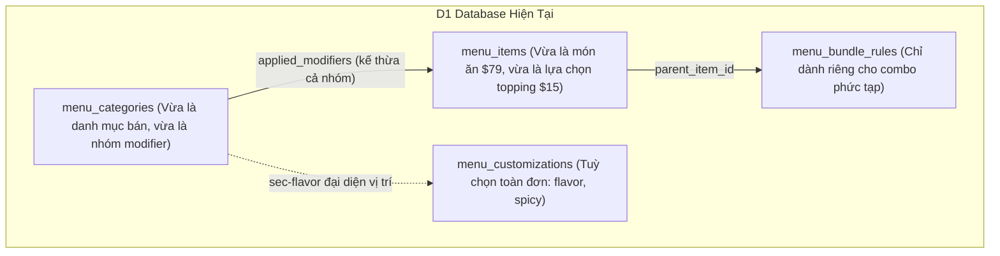
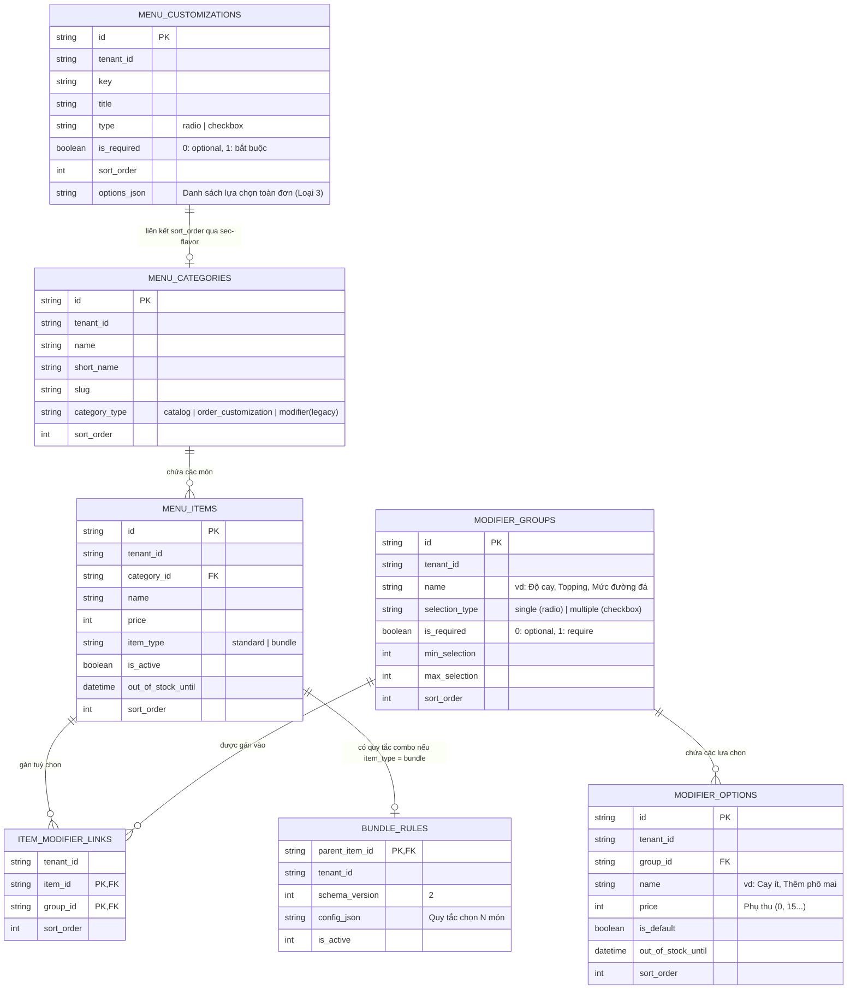
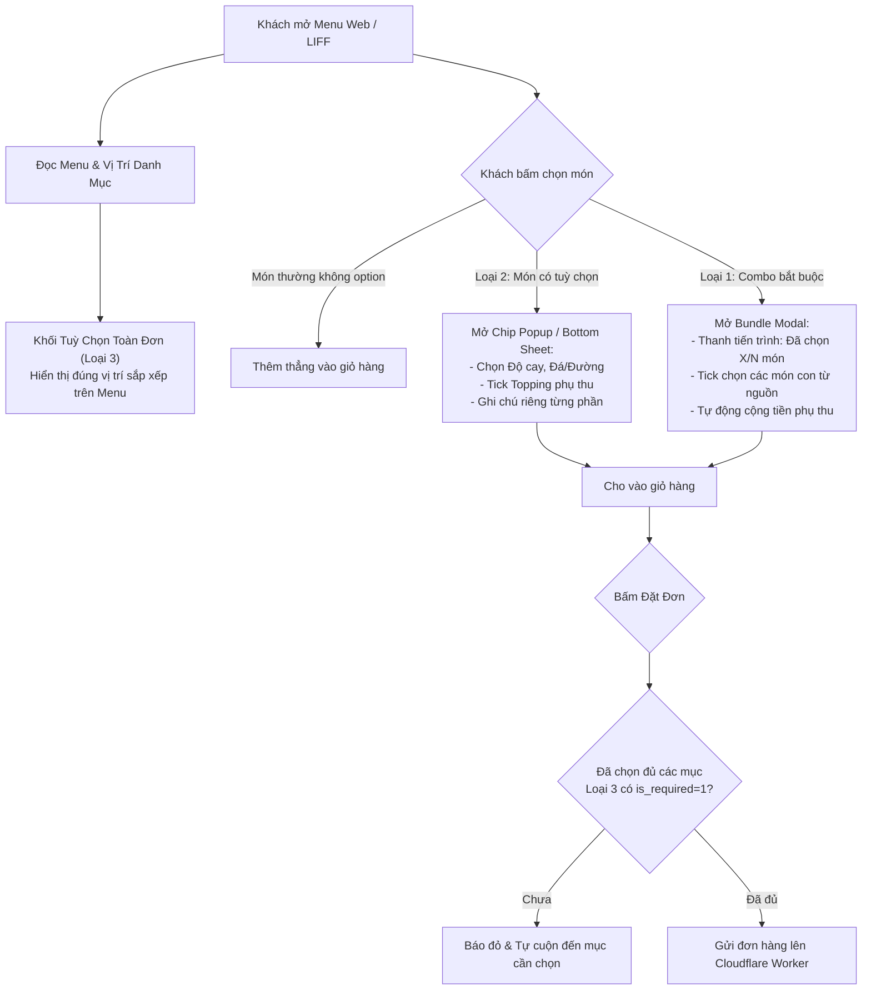

# PDP: Kiến Trúc Hợp Nhất Bundle Combo & Tuỳ Chọn Thực Đơn (Unified Bundle & Customization Architecture)

**Trạng thái**: Đề xuất Kiến trúc Cấp cao (Principal Design Proposal)  
**Ngày cập nhật**: 2026-09-25  
**Hệ thống**: Nền tảng Đặt hàng & POS Đa Chi nhánh Benmi (Benmi Order Multi-Tenant Platform)  
**Tác giả**: Principal Engineer / Core Architecture Team  

---

## 1. Tóm Tắt Điều Hành & Mục Tiêu (Executive Summary & Objectives)

### A. Vấn Đề Thực Tế & Động Lực Cải Tiến (Problem Statement)
Hệ thống quản lý thực đơn POS và Client Menu hiện tại tồn tại sự phân mảnh và chồng chéo về mặt khái niệm:
1. **Tuỳ chọn gắn vào món (Item Modifiers)**: Hiện bị trói chặt ở cấp danh mục (`menu_categories.applied_modifiers`). Không thể gán tuỳ chọn riêng biệt cho từng món (ví dụ: muốn Bánh mì A có phô mai nhưng Bánh mì B không có thì buộc phải tạo 2 danh mục riêng).
2. **Combo / Bundle nhiều món**: Quản lý qua bảng `menu_bundle_rules` với nhiều template phức tạp (`meal`, `fixed`, `many`), gây khó hiểu cho nhân viên thao tác tại quầy tablet.
3. **Tuỳ chọn toàn đơn (Global Order Customizations)**: Quản lý qua bảng `menu_customizations` (`sec-flavor`, ví dụ: dụng cụ ăn uống, độ cay chung tại `bsc`, `jiangjiejie`), nhưng thiếu cờ quy định bắt buộc (`is_required`) tại backend và chưa có quy trình tạo mới đồng bộ với menu.

### B. Mục Tiêu Trọng Tâm (Goals - In-Scope)
- **Chuẩn hoá điểm vào UI duy nhất trên POS (`orders.html`)**: Thay thế các nút tạo rời rạc bằng **1 nút bấm duy nhất `[+ Thêm mới / 建立新項目]`** với **3 thẻ chọn rõ ràng**:
  - **Loại 1 (Combo bắt buộc)**: Chọn đúng và đủ số lượng $N$ món từ các danh mục nguồn (cho phép chọn trùng món hoặc không) + các tuỳ chọn đính kèm.
  - **Loại 2 (Món có tuỳ chọn optional)**: Món đơn lẻ (SKU chuẩn) có các nhóm tuỳ chọn gắn trực tiếp ở cấp Item (Topping, mức đường/đá, sốt thêm).
  - **Loại 3 (Tuỳ chọn toàn đơn)**: Tuỳ chọn áp dụng cho cả giỏ hàng (hỗ trợ `is_required`, tham gia cơ chế kéo thả thứ tự trên thanh sidebar danh mục POS).
- **Tối ưu hoá Data Model trên Cloudflare D1 & KV**:
  - Tách bạch ranh giới nghiệp vụ (Domain Boundaries): Món thường (Standard Item) và Combo (Bundle) có kênh lưu trữ và snapshot độc lập, tránh làm phình to bảng `menu_bundle_rules` và không làm crash engine `validateBundleOrderItems`.
  - Giữ dung lượng cache bootstrap trên Cloudflare KV luôn dưới **50KB** để tốc độ tải menu trên LINE LIFF luôn **< 10ms**.
- **Bảo toàn khả năng Kéo - Thả (Drag & Drop) thứ tự trên Sidebar POS**:
  - Duy trì việc sử dụng bản ghi danh mục đại diện (`sec-flavor`) trong `menu_categories` để nhân viên POS tự do sắp xếp vị trí hiển thị khối Loại 3 trên thực đơn khách hàng.
- **Tương thích ngược 100% (Zero Downtime & Backward Compatibility)**:
  - Giữ nguyên dữ liệu cũ của các tenant đang vận hành ổn định (`benmi`, `bsc`, `jiangjiejie`, `dapinglin`). Các đơn hàng cũ và cơ chế `applied_modifiers` cũ vẫn chạy bình thường.

### C. Những Gì Nằm Ngoài Phạm Vi (Non-Goals - Out-of-Scope)
- Không can thiệp hoặc ép chuyển đổi dữ liệu lịch sử của các tenant cũ (không chạy batch script ép migration dữ liệu cũ nếu tenant không chủ động vào sửa món).
- Không hỗ trợ Combo lồng Combo (Nested Combos - một combo con nằm trong một combo cha).
- Không xây dựng hệ thống quản lý định lượng tồn kho nguyên vật liệu sâu (BOM/Recipe Inventory Tracking).

---

## 2. Bối Cảnh & Kiến Trúc Hiện Tại (Current Architecture Context)



- **Mã nguồn liên quan**:
  - Validation Combo: [`bundle-rules.ts`](file:///Users/duc.cao/Documents/learning/benmi-order/benmi-worker-official/src/modules/bundle-rules.ts)
  - Quản lý Menu & Lưu trữ: [`menu.ts`](file:///Users/duc.cao/Documents/learning/benmi-order/benmi-worker-official/src/modules/menu.ts)
  - Xử lý Đơn hàng: [`orders.ts`](file:///Users/duc.cao/Documents/learning/benmi-order/benmi-worker-official/src/modules/orders.ts)
  - Nạp Menu Khách hàng: [`bootstrap.ts`](file:///Users/duc.cao/Documents/learning/benmi-order/benmi-worker-official/src/modules/bootstrap.ts)
  - Giao diện POS: [`orders-menu.js`](file:///Users/duc.cao/Documents/learning/benmi-order/js/orders-menu.js), [`orders.html`](file:///Users/duc.cao/Documents/learning/benmi-order/orders.html)
  - Giao diện Khách: [`index.html`](file:///Users/duc.cao/Documents/learning/benmi-order/index.html), [`client-checkout.js`](file:///Users/duc.cao/Documents/learning/benmi-order/js/client-checkout.js)

---

## 3. Kiến Trúc Đề Xuất (Target Architecture & Data Model)

### A. Sơ Đồ Thực Thể Quan Hệ Chuẩn Hoá (Clean Relational ERD)



### B. Chi Tiết Các Bảng CSDL D1 & Migration Script

```sql
-- 1. Bảng nhóm tuỳ chọn độc lập (Thư viện Option Groups của quán)
CREATE TABLE IF NOT EXISTS modifier_groups (
    id TEXT PRIMARY KEY,
    tenant_id TEXT NOT NULL,
    name TEXT NOT NULL,             -- "Độ cay", "Topping thêm", "Mức đường đá"
    selection_type TEXT NOT NULL,   -- 'single' (radio) | 'multiple' (checkbox)
    is_required INTEGER DEFAULT 0,  -- 0: optional (Loại 2), 1: bắt buộc
    min_selection INTEGER DEFAULT 0,
    max_selection INTEGER DEFAULT 1,
    sort_order INTEGER DEFAULT 0,
    created_at DATETIME DEFAULT CURRENT_TIMESTAMP
);
CREATE INDEX IF NOT EXISTS idx_mod_groups_tenant ON modifier_groups(tenant_id, sort_order);

-- 2. Bảng các lựa chọn cụ thể bên trong từng nhóm
CREATE TABLE IF NOT EXISTS modifier_options (
    id TEXT PRIMARY KEY,
    tenant_id TEXT NOT NULL,
    group_id TEXT NOT NULL REFERENCES modifier_groups(id) ON DELETE CASCADE,
    name TEXT NOT NULL,             -- "Không cay", "Cay ít", "Thêm phô mai"
    price INTEGER NOT NULL DEFAULT 0, -- Giá cộng thêm (+$0, +$15)
    is_default INTEGER DEFAULT 0,
    sort_order INTEGER DEFAULT 0,
    out_of_stock_until DATETIME,     -- Quản lý hết hàng độc lập ngay tại đây!
    created_at DATETIME DEFAULT CURRENT_TIMESTAMP
);
CREATE INDEX IF NOT EXISTS idx_mod_options_group ON modifier_options(tenant_id, group_id, sort_order);

-- 3. Bảng liên kết Món và Nhóm tuỳ chọn (Item-Level Binding cho Loại 2)
CREATE TABLE IF NOT EXISTS item_modifier_links (
    tenant_id TEXT NOT NULL,
    item_id TEXT NOT NULL REFERENCES menu_items(id) ON DELETE CASCADE,
    group_id TEXT NOT NULL REFERENCES modifier_groups(id) ON DELETE CASCADE,
    sort_order INTEGER DEFAULT 0,
    PRIMARY KEY (item_id, group_id)
);
CREATE INDEX IF NOT EXISTS idx_item_mod_links ON item_modifier_links(tenant_id, item_id);

-- 4. Bổ sung trường item_type cho menu_items
ALTER TABLE menu_items ADD COLUMN item_type TEXT DEFAULT 'standard';

-- 5. Bổ sung is_required cho menu_customizations (Loại 3)
ALTER TABLE menu_customizations ADD COLUMN is_required INTEGER DEFAULT 0;
```

### C. TypeScript Interfaces Cho Engine Xử Lý

```typescript
export interface ModifierOptionDTO {
  id: string;
  name: string;
  price: number;
  isDefault: boolean;
  isOutOfStock: boolean;
}

export interface ModifierGroupDTO {
  id: string;
  name: string;
  selectionType: 'single' | 'multiple';
  isRequired: boolean;
  minSelection: number;
  maxSelection: number;
  options: ModifierOptionDTO[];
}

export interface UniversalBundleConfig {
  version: 2;
  groups: Array<{
    id: string;
    type: 'choice' | 'fixed';
    name: string;
    label: { 'zh-TW': string; vi: string };
    minQuantity: number;
    maxQuantity: number;
    allowRepeats: boolean;
    sources: Array<{
      type: 'category' | 'item_list';
      refId?: string;
      itemIds?: string[];
    }>;
    surcharges: Record<string, number>;
  }>;
}
```

---

## 4. Thiết Kế Giao Diện & Trải Nghiệm Thao Tác (UI / UX Flow)

### A. Bảng Quản Lý POS (`orders.html` / `orders-menu.js`)

#### 1. Giữ Trọn Vẹn Khả Năng Kéo Thả (Drag & Drop) Sidebar
- Thanh danh mục trái (`#menu-categories`) hiển thị danh sách các danh mục món ăn kèm huy hiệu nhận diện.
- Khối **Tuỳ chọn toàn đơn (Loại 3)** hiển thị dưới dạng một danh mục đặc biệt có huy hiệu `[Khẩu vị / 客製化]`.
- Nhân viên có thể nắm kéo icon `[::]` để chuyển vị trí khối này lên đầu menu, giữa các món ăn, hoặc cuối menu. Vị trí này tự động đồng bộ sang giá trị `sort_order` của `sec-flavor`.

#### 2. Điểm Vào Khởi Tạo Hợp Nhất (Unified Header Action)
- Gom các nút tạo cũ thành 1 nút chính: `[+ Thêm mới / 建立新項目]` (`#btn-menu-create-unified`).
- Khi click, hiển thị **Modal Bước 1 (3 Action Cards)**:

```
+---------------------------------------------------------------------------------+
|                                 BƯỚC 1: CHỌN LOẠI KHỞI TẠO                      |
+---------------------------------------------------------------------------------+
|                                                                                 |
|  +------------------------+  +------------------------+  +--------------------+ |
|  | [Icon Layers]          |  | [Icon Sliders]         |  | [Icon Settings]    | |
|  | LOẠI 1: COMBO BẮT BUỘC |  | LOẠI 2: MÓN CÓ TUỲ CHỌN|  | LOẠI 3: TUỲ CHỌN   | |
|  |                        |  |                        |  |         TOÀN ĐƠN   | |
|  | Bán combo gồm đủ N món |  | Món lẻ đính kèm các    |  | Áp dụng chung cho  | |
|  | từ danh mục nguồn      |  | nhóm tuỳ chọn topping, |  | toàn đơn: dụng cụ, | |
|  | + tuỳ chọn đi kèm.     |  | mức đường, đá, sốt...  |  | độ cay, dặn dò...  | |
|  +------------------------+  +------------------------+  +--------------------+ |
|                                                                                 |
+---------------------------------------------------------------------------------+
```

#### 3. Form Nhập Liệu Chi Tiết Bước 2

* **Loại 1: Combo Bắt Buộc (Required Bundle)**:
  - *Cơ bản*: Tên combo, Giá bán ($), Danh mục cha, Ảnh đại diện.
  - *Quy tắc chọn món*: Số món cần chọn ($N \ge 1$), Checkbox cho phép chọn trùng món (`allowRepeats`), Danh mục/Món nguồn hợp lệ, Giá phụ thu (+$).
  - *Tuỳ chọn đính kèm*: Thêm nhóm tuỳ chọn (Đơn/Nhiều), Danh sách lựa chọn và giá cộng thêm.
  - *Lưu trữ*: Ghi vào `menu_items` (`item_type = 'bundle'`) + `menu_bundle_rules`.

* **Loại 2: Món Lẻ Kèm Tuỳ Chọn (Item with Customizations)**:
  - *Cơ bản*: Tên món, Giá bán ($), Danh mục cha, Ảnh đại diện.
  - *Khối Tuỳ chọn*:
    - Cho phép chọn từ **Mẫu nhóm tuỳ chọn có sẵn** (vd: nhóm "Độ cay" hoặc "Topping chung của quán").
    - Hoặc bấm `[+ Tạo nhóm tuỳ chọn riêng cho món này]`.
    - Thiết lập: Tên nhóm, Kiểu chọn (Chọn 1 / Chọn nhiều), Các lựa chọn (Tên + Giá phụ thu + Nút bật/tắt hết hàng).
  - *Lưu trữ*: Ghi vào `menu_items` (`item_type = 'standard'`) và liên kết các nhóm tuỳ chọn qua bảng `item_modifier_links` (trỏ đến `modifier_groups` và `modifier_options`).

* **Loại 3: Tuỳ Chọn Toàn Đơn (Global Order Customization)**:
  - *Thông tin*: Tên nhóm tuỳ chọn (vd: "Dụng cụ ăn uống", "Mức cay toàn đơn").
  - *Kiểu chọn*: Radio (Chọn 1) hoặc Checkbox (Chọn nhiều).
  - *Ràng buộc*: Switch `[ Bắt buộc khách chọn khi đặt hàng (Require) ]`.
  - *Danh sách options*: Tên lựa chọn, Giá phụ thu, Đặt làm mặc định.
  - *Lưu trữ*: Ghi vào `menu_customizations` + cập nhật thứ tự `sec-flavor` trong `menu_categories`.

---

### B. Trải Nghiệm Khách Hàng (Customer Menu Mobile / LIFF: `index.html`)



---

## 5. Chuẩn Hoá Snapshot Đơn Hàng & In Bếp POS (`order_items`)

Khi khách chốt đơn, dữ liệu gửi lên backend được chuẩn hoá rõ ràng giữa 2 luồng:

### A. Món Đơn Kèm Tuỳ Chọn (Loại 2)
- **Cấu trúc lưu `selected_options`**:
  ```json
  [
    { "group": "辣度", "choice": "第1份: Cay vừa", "price": 0 },
    { "group": "加料", "choice": "第1份: Thêm phô mai", "price": 15 },
    { "group": "辣度", "choice": "第2份: Không cay", "price": 0 }
  ]
  ```
- **Hiển thị POS Card & In Phiếu Bếp ([`printer-service.js`](file:///Users/duc.cao/Documents/learning/benmi-order/js/printer-service.js))**:
  ```text
  2x Bánh mì thập cẩm                 $158
     - 第1份: Cay vừa
     - 第1份: Thêm phô mai             +$15
     - 第2份: Không cay
  ```

### B. Món Combo Bắt Buộc (Loại 1)
- **Cấu trúc lưu `bundle_snapshot_json`**:
  ```json
  {
    "bundleRuleId": "rule_combo_lunch",
    "portions": [
      {
        "portionIndex": 0,
        "groups": [
          {
            "groupId": "grp_main",
            "groupName": "Món chính",
            "items": [{ "itemId": "bm_thit", "name": "Bánh mì thịt", "quantity": 1, "surcharge": 0 }]
          },
          {
            "groupId": "grp_drink",
            "groupName": "Đồ uống",
            "items": [{ "itemId": "tea_dao", "name": "Trà đào", "quantity": 1, "surcharge": 10 }]
          }
        ]
      }
    ]
  }
  ```
- **Hiển thị POS Card & In Phiếu Bếp**:
  ```text
  1x COMBO ĂN TRƯA                    $120
     ↳ Món chính: Bánh mì thịt
     ↳ Đồ uống: Trà đào (+$10)
  ```

---

## 6. Các Mối Quan Tâm Xuyên Suốt (Cross-Cutting Concerns)

### A. Zero-Trust Pricing Validation (Chống Giả Mạo Giá Server-Side)
- Khi nhận payload `POST /api/orders`, Worker tại [`orders.ts`](file:///Users/duc.cao/Documents/learning/benmi-order/benmi-worker-official/src/modules/orders.ts) thực hiện thẩm định giá độc lập từ CSDL:
  1. Với món Loại 2: Đọc các option được chọn từ bảng `modifier_options`, cộng tổng tiền phụ thu chính thức vào `base_price * quantity`. So sánh với `subtotal` client gửi lên, nếu chênh lệch $> 0.001$ thì từ chối đơn ngay lập tức với mã lỗi `409 PRICE_CHANGED`.
  2. Với món Loại 1: Đọc `config_json` từ `menu_bundle_rules` và tính toán qua `validateBundleOrderItems()`.
  3. Với Loại 3: Kiểm tra cờ `is_required`. Nếu có nhóm yêu cầu bắt buộc mà payload `customizations` gửi lên rỗng hoặc thiếu thì trả về mã lỗi `400 ORDER_CUSTOMIZATION_REQUIRED`.

### B. Quản Lý Trạng Thái Hết Hàng (Out-of-Stock Management)
- Đối với các lựa chọn tuỳ chọn của Loại 2:
  - Cung cấp API cập nhật nhanh trạng thái tồn kho của từng option: `POST /api/menu/toggle-option-stock`.
  - Cập nhật trực tiếp cột `out_of_stock_until` trong bảng `modifier_options` và xóa cache KV `tenant:{tenant_id}:bootstrap`.
  - Toàn bộ các món ăn có liên kết với option này lập tức chuyển sang trạng thái hết hàng mà không cần phải mở form sửa từng món.

### C. Chuẩn Đa Ngôn Ngữ (I18N Compliant)
- Tuân thủ nghiêm ngặt quy tắc [ui-design-principles.md](file:///Users/duc.cao/Documents/learning/benmi-order/.agents/rules/ui-design-principles.md):
  - Mọi tiêu đề nhóm, tên option đều hỗ trợ lưu trữ chuẩn đa ngữ.
  - Từ điển tiếng Trung phồn thể thuần túy, tiếng Việt chuẩn POS, không chèn chú thích lẫn lộn ngôn ngữ.

---

## 7. Kế Hoạch Triển Khai Chi Tiết (Step-by-Step Execution Plan)

### Phase 1: Database Migration & Backend Schema Foundation (PR #1)
- Tạo migration D1: `0054_unified_bundle_and_customization_schema.sql`:
  - Tạo các bảng: `modifier_groups`, `modifier_options`, `item_modifier_links`.
  - Thêm cột `is_required` vào `menu_customizations`.
  - Thêm cột `item_type` vào `menu_items`.
- Cập nhật [`bootstrap.ts`](file:///Users/duc.cao/Documents/learning/benmi-order/benmi-worker-official/src/modules/bootstrap.ts):
  - Nạp danh sách `modifier_groups` và `modifier_options` theo `item_modifier_links`.
  - Bổ sung `is_required` vào danh sách `customizations`.
- Cập nhật [`orders.ts`](file:///Users/duc.cao/Documents/learning/benmi-order/benmi-worker-official/src/modules/orders.ts):
  - Thêm bước kiểm tra `is_required` của Loại 3.
  - Bổ sung xác thực giá phụ thu của Loại 2 qua bảng `modifier_options`.

### Phase 2: POS Management UI (`orders.html` / `orders-menu.js`) (PR #2)
- Xây dựng nút tạo hợp nhất `#btn-menu-create-unified`.
- Thiết kế Modal Bước 1 (3 Action Cards).
- Hoàn thiện Form Bước 2 cho:
  - Loại 1 (Combo bắt buộc $N$ món).
  - Loại 2 (Món lẻ kèm tuỳ chọn gán qua `item_modifier_links`).
  - Loại 3 (Tuỳ chọn toàn đơn kèm checkbox Bắt buộc chọn).
- Duy trì đồng bộ việc kéo thả sắp xếp danh mục và `sec-flavor`.
- Khai báo đầy đủ key đa ngôn ngữ trong `I18N["zh-TW"]` và `I18N["vi"]`.

### Phase 3: Client Menu & Checkout Integration (`index.html` / `client-checkout.js`) (PR #3)
- Render giao diện Chip Popup / Bottom Sheet cho món Loại 2 trên mobile.
- Bổ sung validation chặn gửi đơn tại checkout nếu chưa chọn các mục Loại 3 có `is_required = 1`.
- Đảm bảo hiển thị đúng giỏ hàng, tổng tiền và đồng bộ LocalStorage.

### Phase 4: Printer Service, Testing & Cache Busting (PR #4)
- Kiểm tra định dạng in ấn máy in nhiệt bếp trên [`printer-service.js`](file:///Users/duc.cao/Documents/learning/benmi-order/js/printer-service.js).
- Chạy kiểm tra tĩnh phạm vi biến toàn cục: `node scripts/check-frontend.js`.
- Cập nhật version cache-buster `?v=YYYYMMDD_unified_customization_v1` trong `orders.html` và `index.html`.

---

## 8. Kế Hoạch Kiểm Thử & Xác Minh (Verification & Test Matrix)

| STT | Kịch Bản Kiểm Thử | Dữ Liệu Đầu Vào | Kết Quả Mong Đợi | Trạng Thái |
| :---: | :--- | :--- | :--- | :---: |
| **TC-01** | Tạo món Loại 1 (Combo 2 món) qua POS | Nhập 2 món nguồn từ danh mục Bánh mì và Nước | Lưu thành công vào `menu_items` + `menu_bundle_rules`. Mở modal chọn đủ 2 món. | Sẵn sàng test |
| **TC-02** | Tạo món Loại 2 (Món có topping) qua POS | Bánh mì $65 + Topping phô mai $15 (optional) | Lưu vào `modifier_options` và `item_modifier_links`. Bấm vào món hiện Chip Popup. | Sẵn sàng test |
| **TC-03** | Tạo tuỳ chọn Loại 3 có `is_required = 1` | "Dụng cụ ăn uống" (Bắt buộc chọn) | Khách chưa tick chọn thì bị chặn tại giỏ hàng và cuộn đến mục đó. | Sẵn sàng test |
| **TC-04** | Kéo thả thứ tự Loại 3 trên POS | Kéo `sec-flavor` lên vị trí đầu tiên | Menu khách hàng hiển thị khối tuỳ chọn toàn đơn ngay đầu trang. | Sẵn sàng test |
| **TC-05** | Tương thích ngược tenant cũ (`benmi`, `bsc`) | Đặt món có modifier cũ qua `applied_modifiers` | Đơn hàng nhận bình thường, tính đúng tiền, in bill đúng gạch đầu dòng. | Sẵn sàng test |
| **TC-06** | Chống giả mạo giá (Zero-Trust Security) | Dùng curl gửi `subtotal` thấp hơn giá thực tế | Backend trả về HTTP 409 `PRICE_CHANGED` và từ chối đơn. | Sẵn sàng test |
| **TC-07** | In ấn phiếu bếp LAN/Bluetooth | Đơn gồm cả Loại 1, 2 và 3 | Máy in in rõ ràng từng dòng: Combo thụt lề `↳`, Món đơn gạch đầu dòng `-`. | Sẵn sàng test |

---

## 9. Kế Hoạch Rollback & Giám Sát (Rollback Plan & Observability)

- **Cờ Tính Năng (Feature Flag)**:
  - Tính năng được bảo vệ bởi cờ `enable_unified_menu_editor_v2` trong `tenant_config.features`.
  - Có thể kích hoạt thử nghiệm cho từng tenant dev/staging trước khi bật toàn bộ.
- **Tiêu Chí Kích Hoạt Rollback**:
  - Tỷ lệ lỗi tạo đơn hàng trên Worker $> 0.5\%$ trong 15 phút.
  - POS gặp lỗi không lưu được menu hoặc máy in bill in sai thông tin món.
- **Quy Trình Rollback (Zero-Downtime Revert)**:
  1. Tắt cờ `enable_unified_menu_editor_v2` trong `tenant_config`. Hệ thống tự động fallback về editor cũ.
  2. Do các bảng mới độc lập và các cột mới đều có giá trị mặc định (`DEFAULT 0`), việc rollback code Worker/Frontend hoàn toàn không gây lỗi dữ liệu CSDL.

