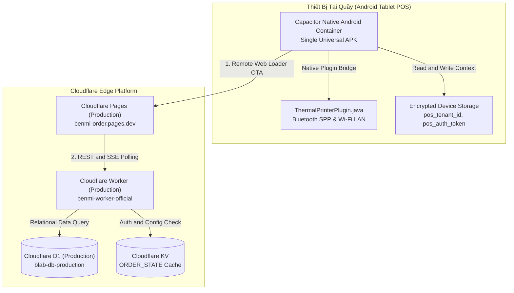
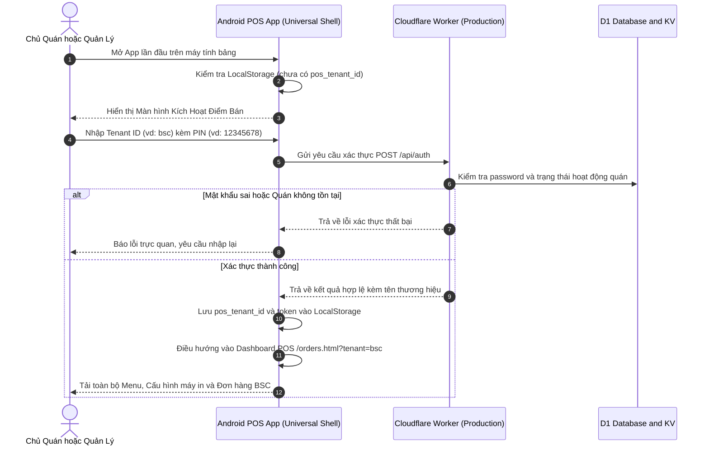

# PDP: Kiến Trúc Ứng Dụng POS Đa Điểm Bán Mở Rộng Cho Hàng Nghìn Quán (Universal Multi-Tenant POS Platform)

> **Trạng thái:** Đã thống nhất qua Phỏng vấn Thiết kế (/grill-me)  
> **Tác giả:** Principal Engineer (AI Pair)  
> **Ngày:** 2026-09-03  
> **Mục tiêu phát hành:** Hệ sinh thái POS Android & Web (Mở rộng quy mô 1,000+ Quán)  

---

## 1. Tóm Tắt Tổng Quan & Bối Cảnh (Executive Summary)

### 1.1. Bối Cảnh & Vấn Đề (Problem Statement)
Hiện tại, ứng dụng Android POS (`apps/android-pos/`) đang gặp 2 rào cản lớn ngăn cản việc mở rộng thương mại dài hạn:
1. **Lệch Môi Trường Cục Bộ (Localhost Dev Trap):**
   App Android đang chạy WebView từ file nội bộ đóng gói trong APK (`dist/`), dẫn đến `window.location.hostname === "localhost"`. Logic nhận diện môi trường trong [orders-core.js](file:///Users/duccao/Documents/benmi-order/js/orders-core.js#L6) tự động gán app vào môi trường **DEV** (`https://platform-worker-dev.thuanmnc.workers.dev` kết nối CSDL `blab-db-dev`).
2. **Hardcode/Fallback Cố Định 1 Quán Duy Nhất:**
   App mở trang gốc không có query params, dẫn đến `getTenantIdFromUrl()` luôn fallback về `"benmi"`. Không có cơ chế nhận diện máy tính bảng này đang thuộc về quán nào (BSC, Benmi, Weiweibao, Zhadantongxue...).
3. **Chi Phí Vận Hành Khi Scale (Operational Overhead):**
   Nếu mỗi khi có 1 quán mới lại phải sửa code, đổi tên, build ra 1 file APK riêng (`bsc-pos.apk`, `benmi-pos.apk`...) hoặc mỗi khi sửa 1 nút bấm/CSS lại phải gửi file APK bắt chủ quán cài lại thì hệ thống sẽ **vỡ trận khi có từ 10 quán trở lên**.

### 1.2. Mục Tiêu Đạt Được (Goals - In-Scope)
* **1 Bản APK Phổ Quát Duy Nhất (Single Universal POS App):** Chỉ build và phân phối 1 file APK duy nhất cho toàn bộ 1,000+ đối tác quán F&B.
* **Cập Nhật Không Gián Đoạn (Remote Cloud Loader - Over-The-Air Updates):** App Android đóng vai trò là "Native Shell" bảo mật, tải trực tiếp giao diện POS từ Cloudflare Pages Production. Mọi bản vá lỗi giao diện, cập nhật tính năng, tinh chỉnh layout máy in sẽ có hiệu lực ngay lập tức cho 1,000+ máy tính bảng khi deploy web mà **không cần cài lại APK**.
* **Luồng Kích Hoạt & Ghép Đôi Quán Bảo Mật (Store Activation & Pairing Flow):** Lần đầu mở app, hiển thị màn hình thiết lập tinh giản: Nhập **Mã Quán (Tenant ID)** + **Mã PIN Quản Lý (Store PIN)**. Xác thực qua API Worker và lưu trữ bền vững trên thiết bị.
* **Tách Biệt Môi Trường Bằng Build Flavor (Environment Isolation):** Bản build Release cho khách hàng được khóa cứng 100% vào **PRODUCTION** (`benmi-order.pages.dev` + `benmi-worker-official`). Tạo lệnh build riêng cho DEV để phục vụ kiểm thử nội bộ mà không gây rủi ro nhầm lẫn cho quán.
* **Bảo Toàn Kết Nối Phần Cứng Native (Hardware Bridge):** Duy trì 100% khả năng in tem TSPL và in hóa đơn ESC/POS qua Bluetooth & Wi-Fi LAN thông qua Capacitor Native Plugin (`ThermalPrinterPlugin.java`).

### 1.3. Ngoài Phạm Vi (Non-Goals)
* Không áp dụng cơ chế xác thực phức tạp theo từng tài khoản nhân viên (Shift management) trong giai đoạn này; tập trung vào xác thực mức độ Điểm Bán (Device / Store Level Authentication).

---

## 2. Kiến Trúc Hệ Thống (System Architecture)



---

## 3. Quy Trình Vận Hành & Luồng Dữ Liệu (Operational Flow)

### 3.1. Luồng Mở App Lần Đầu (First-Time Store Activation)


### 3.2. Luồng Khởi Động Ở Các Lần Tiếp Theo (Seamless Auto-Login)
1. Khi nhân viên bật máy tính bảng hoặc mở app vào ca làm việc:
   * App đọc `pos_tenant_id` từ bộ nhớ máy tính bảng (ví dụ: `bsc`).
   * Tự động tải thẳng giao diện: `https://benmi-order.pages.dev/orders.html?tenant=bsc`.
   * Giao diện nhận diện ngay lập tức quán `bsc`, hydrate logo, màu sắc, danh mục món và thiết lập máy in chỉ trong `< 500ms`.
2. Nhân viên không cần đăng nhập lại mỗi ngày.

### 3.3. Luồng Chuyển Đổi Quán / Hủy Ghép Đôi (Unlink Device / Switch Tenant)
* Trong màn hình **Cài Đặt POS** ([orders-settings.js](file:///Users/duccao/Documents/benmi-order/js/orders-settings.js)), bổ sung khu vực **"Thiết Bị & Điểm Bán"**:
  * Hiển thị: Quán hiện tại (`BSC 干城鹹水雞`), Mã định danh (`bsc`), Phiên bản POS.
  * Nút hành động: **"Đổi Quán / Hủy Ghép Đôi Thiết Bị"**.
  * Khi bấm, hệ thống yêu cầu nhập đúng **Mã PIN Quản Lý** của quán đó trước khi xóa `pos_tenant_id` và đưa máy về màn hình kích hoạt ban đầu. Điều này ngăn ngừa nhân viên thu ngân bấm nhầm làm ngắt quãng bán hàng.

---

## 4. Chi Tiết Kỹ Thuật (Technical Implementation Plan)

### 4.1. Cấu Hình Capacitor Remote Cloud Loader ([capacitor.config.ts](file:///Users/duccao/Documents/benmi-order/apps/android-pos/capacitor.config.ts))
Thay vì cấu hình load file tĩnh cục bộ (`dist`), cấu hình trỏ thẳng tới Production Cloudflare Pages:
```typescript
import type { CapacitorConfig } from '@capacitor/cli';

const isDevBuild = process.env.APP_ENV === 'dev';

const config: CapacitorConfig = {
  appId: 'com.benmi.pos',
  appName: 'Benmi POS Platform',
  webDir: 'dist',
  server: {
    // Bản Production trỏ thẳng vào Cloudflare Pages Production
    url: isDevBuild 
      ? 'https://dev.benmi-order.pages.dev/orders.html'
      : 'https://benmi-order.pages.dev/orders.html',
    cleartext: true,
    androidScheme: 'https'
  },
  android: {
    allowMixedContent: true,
    backgroundColor: '#0f172a'
  }
};

export default config;
```

### 4.2. Khởi Tạo Màn Hình Kích Hoạt (Store Activation Screen)
Trong [orders.html](file:///Users/duccao/Documents/benmi-order/orders.html) và [orders-core.js](file:///Users/duccao/Documents/benmi-order/js/orders-core.js):
1. **Quy tắc trích xuất `tenant_id` mở rộng:**
   ```javascript
   function getResolvedTenantId() {
     const params = new URLSearchParams(window.location.search);
     const urlTenant = params.get("tenant") || params.get("tenant_id");
     if (urlTenant) return urlTenant;
     
     // Đọc từ bộ nhớ máy tính bảng nếu chạy trong App
     const savedTenant = localStorage.getItem("pos_device_tenant_id");
     if (savedTenant) return savedTenant;
     
     return null; // Chưa kích hoạt
   }
   ```
2. **Bộ điều khiển kích hoạt (Activation Controller):**
   * Nếu `getResolvedTenantId() === null`: Ẩn toàn bộ topbar và bảng đơn hàng, hiển thị Modal toàn màn hình với thiết kế tối giản, cao cấp:
     * Nhập Mã Quán (Ví dụ: `bsc`, `benmi`, `zhadantongxue`...)
     * Nhập Mã PIN Quản Lý (Mặc định `12345678` nếu quán chưa đổi)
     * Nút **"Kích Hoạt Điểm Bán"** (Kích thước lớn 48px chuẩn cảm ứng)
   * Khi kích hoạt thành công: Lưu `localStorage.setItem("pos_device_tenant_id", tenantId)` và reload trang với `?tenant=${tenantId}`.

### 4.3. Tách Biệt Build Flavors Trong Scripts ([package.json](file:///Users/duccao/Documents/benmi-order/apps/android-pos/package.json))
Tạo các lệnh build rõ ràng, tách biệt hoàn toàn giữa bản cho Quán (Production) và bản Kỹ Thuật (Dev):
* `npm run build:prod`: Đóng gói file APK `benmi-pos-universal-v1.3.apk` trỏ cố định vào Production Pages & Worker.
* `npm run build:dev`: Đóng gói file APK `benmi-pos-dev-v1.3.apk` trỏ vào Dev Pages & Worker.

---

## 5. Ma Trận So Sánh Các Giải Pháp (Alternatives & Trade-Offs)

| Tiêu chí | 🌟 Giải Pháp Được Chọn (Universal Cloud App) | Phương án Đóng Gói Tĩnh (Local Bundled) | Phương án Build Riêng Từng Quán (White-label) |
| :--- | :--- | :--- | :--- |
| **Khả năng mở rộng 1,000+ quán** | **Tối đa (1 file APK duy nhất cho toàn bộ hệ thống)** | Cao (1 file APK, nhưng khó update web) | **Cực thấp (Phải build và quản lý 1,000 file APK)** |
| **Quy trình cập nhật tính năng / Sửa lỗi** | **Tức thì (Deploy web là tất cả các quán có ngay)** | Phải build APK mới, yêu cầu quán tải lại | Phải build 1,000 APK và gửi riêng lẻ |
| **Rủi ro vận hành** | Bằng 0 (Khóa cứng Production, không thể đổi nhầm) | Quán có thể chạy code cũ bị lỗi thời | Tốn công bảo trì hạ tầng build |
| **Tốc độ mở quán mới** | **Dưới 1 phút (Cài APK, gõ mã quán + PIN là bán hàng)** | Dưới 1 phút | Mất 30 phút chờ kỹ thuật build APK riêng |

---

## 6. Lộ Trình Triển Khai (Execution Milestones)

- [ ] **Giai đoạn 1: Chuẩn hóa logic xác thực Tenant trên Frontend POS**
  - Cập nhật [orders-core.js](file:///Users/duccao/Documents/benmi-order/js/orders-core.js) hỗ trợ đọc `tenant_id` từ `localStorage.getItem("pos_device_tenant_id")`.
  - Thiết kế Modal Kích hoạt Điểm Bán (Store Activation Modal) chuẩn phong cách tối giản F&B trong [orders.html](file:///Users/duccao/Documents/benmi-order/orders.html) và [orders-modals.js](file:///Users/duccao/Documents/benmi-order/js/orders-modals.js).
- [ ] **Giai đoạn 2: Bổ sung Quản lý Điểm Bán trong Cài đặt POS**
  - Thêm mục "Thông tin Quán & Đổi điểm bán" trong [orders-settings.js](file:///Users/duccao/Documents/benmi-order/js/orders-settings.js).
  - Bảo vệ thao tác Đổi quán bằng mã PIN quản lý qua endpoint `/api/auth`.
- [ ] **Giai đoạn 3: Cấu hình Capacitor Cloud Loader & Build Scripts**
  - Cập nhật [capacitor.config.ts](file:///Users/duccao/Documents/benmi-order/apps/android-pos/capacitor.config.ts) trỏ `server.url` về Production Cloudflare Pages.
  - Bổ sung cấu hình build tách biệt `build:prod` và `build:dev` trong [package.json](file:///Users/duccao/Documents/benmi-order/apps/android-pos/package.json).
- [ ] **Giai đoạn 4: Kiểm thử End-to-End & Xuất bản APK v1.4**
  - Kiểm thử kích hoạt quán `bsc` $\rightarrow$ Kiểm tra tải menu, in tem, in bill đơn hàng.
  - Kiểm thử đổi sang quán `benmi` $\rightarrow$ Kiểm tra cách ly dữ liệu và cấu hình máy in độc lập.
