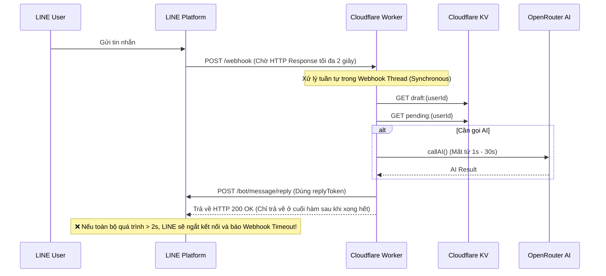
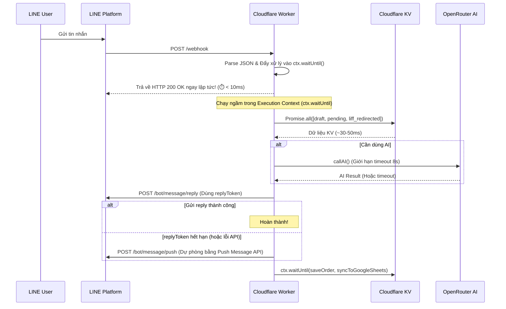

# PDP: LINE Webhook Latency & Dropped Replies Fix

*Author: Antigravity (Principal Engineer)*  
*Status: Proposed*  
*Date: 2026-07-06*

---

## 1. Executive Summary & Objectives

### Problem Statement

Khi người dùng gửi tin nhắn trực tiếp trên LINE (không qua LIFF mini app), hệ thống gặp hai vấn đề nghiêm trọng:

1. **Độ trễ cao (High Latency)**: Phản hồi chậm đáng kể, gây trải nghiệm kém.
2. **Mất phản hồi (Dropped Replies)**: Nhiều trường hợp hệ thống hoàn toàn không trả lời tin nhắn của người dùng.

Sau khi phân tích toàn bộ codebase và tài liệu của LINE Platform, tôi đã xác định được **5 nguyên nhân gốc (root causes)**, nổi bật nhất là việc **vi phạm thời gian handshake/timeout 2 giây** của LINE và việc hết hạn `replyToken` khi chạy AI chậm.

### Goals (In-Scope)
- [x] Xác định root causes gây latency và dropped replies
- [ ] Phản hồi HTTP 200 OK về cho LINE Platform trong **< 50ms** (vượt xa yêu cầu 2s của LINE)
- [ ] Đảm bảo **100% tin nhắn** từ người dùng đều được xử lý và có phản hồi (hoặc intentionally silent)
- [ ] Bổ sung cơ chế fallback tự động sử dụng `pushLineMessage` khi `replyToken` hết hạn
- [ ] Giữ nguyên business logic hiện tại, chỉ tối ưu kiến trúc xử lý và lưu trữ

### Non-Goals (Out-of-Scope)
- [ ] Thay đổi AI model hoặc provider (OpenRouter)
- [ ] Redesign giao diện LIFF mini app
- [ ] Thêm tính năng mới cho hệ thống order

---

## 2. Context & Current Architecture

### Luồng xử lý hiện tại

Khi người dùng gửi tin nhắn trên LINE → LINE Platform gọi webhook `POST /webhook` → Cloudflare Worker xử lý **tuần tự** trong [handleLineWebhook](file:///Users/duc.cao/Documents/learning/benmi-order/benmi-worker-official/src/modules/line.ts#L211-L553).



### Các file liên quan
- Entry point: [index.ts](file:///Users/duc.cao/Documents/learning/benmi-order/benmi-worker-official/src/index.ts)
- **LINE webhook handler (core problem)**: [line.ts](file:///Users/duc.cao/Documents/learning/benmi-order/benmi-worker-official/src/modules/line.ts)
- AI integration: [openRouter.ts](file:///Users/duc.cao/Documents/learning/benmi-order/benmi-worker-official/src/integrations/openRouter.ts)
- Order persistence: [orders.ts](file:///Users/duc.cao/Documents/learning/benmi-order/benmi-worker-official/src/modules/orders.ts)
- Wrangler config: [wrangler.jsonc](file:///Users/duc.cao/Documents/learning/benmi-order/benmi-worker-official/wrangler.jsonc)

---

## 3. Root Cause Analysis

### 🔴 Root Cause #1: Vi phạm thời hạn Webhook Response 2 giây của LINE (CRITICAL)

> [!IMPORTANT]
> LINE Platform có cơ chế kiểm tra kết nối (handshake) và webhook phản hồi rất nghiêm ngặt. Nếu server không trả về **HTTP 2xx response trong vòng 2 giây**, LINE sẽ coi như webhook thất bại và ngắt kết nối ngay lập tức.

Trong code hiện tại:
- `handleLineWebhook` thực hiện toàn bộ logic (đọc KV, gọi AI, gọi LINE Reply API, ghi KV) một cách **đồng bộ (synchronous)** trong main thread của request.
- Các API call tới OpenRouter (`callAI`) thường mất **1.5s - 5s**, đôi khi lên tới **10s - 20s** nếu mạng chậm hoặc cold start.
- Do đó, thời gian phản hồi HTTP của Worker luôn lớn hơn 2 giây khi có AI can thiệp → **LINE ngắt kết nối giữa chừng**, dẫn đến tin nhắn bị mất và hệ thống báo lỗi timeout.

---

### 🔴 Root Cause #2: `replyToken` hết hạn khi chạy background AI không có timeout (CRITICAL)

**Vị trí**: [line.ts L525-L548](file:///Users/duc.cao/Documents/learning/benmi-order/benmi-worker-official/src/modules/line.ts#L525-L548) (AI fallback path) và [line.ts L327-L353](file:///Users/duc.cao/Documents/learning/benmi-order/benmi-worker-official/src/modules/line.ts#L327-L353) (draft processing path).

- Để tránh block HTTP response, một số nhánh code sử dụng `ctx.waitUntil()` để chạy AI trong background.
- Tuy nhiên, `replyToken` của LINE chỉ có hạn sử dụng **khoảng 30 giây** kể từ lúc user gửi tin nhắn.
- Do `callAI()` không có timeout (không cấu hình `signal` hay `timeout` cho fetch), nếu OpenRouter bị chậm hoặc treo:
  1. AI call mất > 30 giây mới phản hồi.
  2. Khi AI phản hồi xong, Worker gọi `replyText(replyToken)` → LINE báo lỗi token expired.
  3. Lỗi này bị nuốt im lặng (không log lỗi) → User không bao giờ nhận được phản hồi.

---

### 🟠 Root Cause #3: Quá nhiều sequential KV reads trên critical path (Gây Latency)

> [!WARNING]
> Mỗi lần đọc Cloudflare KV mất từ **10ms - 50ms**. Việc gọi tuần tự (await từng cái một) tích lũy độ trễ lớn.

Trong `handleLineWebhook`, các lệnh đọc KV diễn ra nối tiếp:
1. `env.ORDER_STATE.get(draftKey)`
2. `getPendingMap(env, userId)`
3. `env.ORDER_STATE.get(liff_redirected:${userId})`

Nếu chạy tuần tự, tổng thời gian đọc KV có thể mất **150ms - 200ms**, làm giảm đáng kể khả năng phản hồi nhanh.

---

### 🟠 Root Cause #4: `saveOrder()` ghi KV quá nhiều và đồng bộ trước khi reply

**Vị trí**: [orders.ts L242-L276](file:///Users/duc.cao/Documents/learning/benmi-order/benmi-worker-official/src/modules/orders.ts#L242-L276).

Mỗi lần `saveOrder()` được gọi, nó thực hiện tới **5 thao tác KV tuần tự** (2 read, 3 put) để cập nhật đơn hàng, danh sách index, và cache view. Trong flow xử lý tin nhắn của khách, hàm này được gọi **trước** khi gửi reply, khiến khách hàng phải đợi thêm **150ms - 250ms**.

---

### 🟡 Root Cause #5: Thiếu Error Logging cho LINE APIs

Hàm `replyText()` và `replyWithLiffRedirect()` thực hiện fetch API của LINE nhưng không kiểm tra status code trả về, cũng không log lỗi ra console khi API fail. Khi xảy ra sự cố (hết quota, expired token, signature error), hệ thống không có bất kỳ log nào để điều tra.

---

## 4. Proposed Architecture

### Đề xuất giải pháp: "Response-First & Background Processing"

Để giải quyết triệt để giới hạn 2 giây của LINE và tối ưu hóa tốc độ, kiến trúc mới sẽ hoạt động như sau:

1. **Phản hồi 200 OK ngay lập tức (< 10ms)**: webhook nhận request, parse JSON, đẩy toàn bộ logic xử lý sự kiện vào `ctx.waitUntil()` và lập tức return HTTP 200 OK cho LINE.
2. **Đọc dữ liệu song song (Parallel KV Reads)**: Sử dụng `Promise.all` để lấy đồng thời `draft`, `pending` và `liff_redirected` ngay khi bắt đầu xử lý event trong background.
3. **Cơ chế Fallback thông minh cho Reply Token**: Nếu gọi AI chậm dẫn đến `replyToken` hết hạn (hoặc `replyText` trả về lỗi), hệ thống sẽ tự động chuyển sang sử dụng `pushLineMessage` (Push API) làm phương án dự phòng để đảm bảo tin nhắn luôn tới tay người dùng.

### System Architecture Diagram (After Fix)



---

## 5. Detailed Design & Implementation Changes

### 1. Thay đổi cốt lõi tại `handleLineWebhook`

Chuyển đổi toàn bộ flow xử lý của webhook thành bất đồng bộ bằng cách đưa vào `ctx.waitUntil`. Webhook chính sẽ trả về 200 OK ngay lập tức:

```typescript
export async function handleLineWebhook(request: Request, env: Env, ctx: ExecutionContext): Promise<Response> {
  const body: any = await request.json().catch(() => ({}));
  const events = Array.isArray(body.events) ? body.events : [];

  if (events.length > 0) {
    // Đưa toàn bộ việc xử lý event vào background để không block HTTP response
    ctx.waitUntil((async () => {
      try {
        await processLineEvents(events, env, ctx);
      } catch (err) {
        console.error("[Benmi] Error processing webhook events in background:", err);
      }
    })());
  }

  // Trả về 200 OK ngay lập tức cho LINE trong < 10ms
  return new Response("OK", { status: 200, headers: corsHeaders() });
}
```

---

### 2. Tối ưu hóa đọc KV song song (Parallel Reading)

Trong hàm `processLineEvents`, thay vì đọc tuần tự, chúng ta đọc toàn bộ thông tin trạng thái của user trong 1 lần gọi `Promise.all`:

```typescript
async function processLineEvents(events: any[], env: Env, ctx: ExecutionContext): Promise<void> {
  for (const event of events) {
    if (!event || event.type !== "message") continue;
    const message = event.message || {};
    if (message.type !== "text") continue;

    const replyToken = event.replyToken;
    const userId = event.source?.userId;
    if (!userId) continue;

    const userText = message.text || "";
    const pendingKey = `pending:${userId}`;
    const draftKey = `draft:${userId}`;
    const redirectedKey = `liff_redirected:${userId}`;

    // Đọc song song cả 3 key trạng thái từ KV
    const [draftRaw, pendingRaw, liffRedirected] = await Promise.all([
      env.ORDER_STATE.get(draftKey),
      env.ORDER_STATE.get(pendingKey),
      env.ORDER_STATE.get(redirectedKey)
    ]);
    
    // Tiếp tục xử lý logic dựa trên dữ liệu đã pre-fetch...
  }
}
```

---

### 3. Cải tiến `replyText` và cơ chế Fallback sang Push Message

Hàm `replyText` sẽ trả về `boolean` cho biết gửi thành công hay thất bại. Nếu thất bại (do hết hạn replyToken), hệ thống tự động gọi `pushLineMessage` để gửi tin nhắn trực tiếp bằng `userId`.

```typescript
export async function replyText(replyToken: string, text: string, env: Env): Promise<boolean> {
  const token = env.LINE_CHANNEL_TOKEN;
  if (!token || !replyToken) return false;

  try {
    const res = await fetch("https://api.line.me/v2/bot/message/reply", {
      method: "POST",
      headers: {
        "Content-Type": "application/json",
        Authorization: `Bearer ${token}`,
      },
      body: JSON.stringify({
        replyToken,
        messages: [{ type: "text", text }],
      }),
    });

    if (!res.ok) {
      const errorBody = await res.text().catch(() => "");
      console.error(`[Benmi] replyText FAILED: status=${res.status} body=${errorBody}`);
      return false;
    }
    return true;
  } catch (e: any) {
    console.error(`[Benmi] replyText EXCEPTION: ${e.message}`);
    return false;
  }
}

// Hàm gửi tin nhắn có cơ chế fallback
export async function sendLineReplyOrPush(
  replyToken: string, 
  userId: string, 
  text: string, 
  env: Env
): Promise<void> {
  // 1. Thử reply trước (Free & Preferred)
  const success = await replyText(replyToken, text, env);
  
  // 2. Nếu reply thất bại (hết hạn token), chuyển sang Push API (Tốn quota nhưng đảm bảo nhận được tin)
  if (!success && userId) {
    console.warn(`[Benmi] replyToken expired or failed. Falling back to pushLineMessage for user=${userId}`);
    await pushLineMessage(userId, text, env);
  }
}
```

---

### 4. Thiết lập Timeout cho AI Call (`callAI`)

Cấu hình `AbortController` với timeout tối đa 8 giây để tránh treo request vô hạn:

```typescript
export async function callAI(prompt: string, env: Env, timeoutMs: number = 8000): Promise<string | null> {
  try {
    if (!env.OPENROUTER_API_KEY) return null;

    const controller = new AbortController();
    const timeoutId = setTimeout(() => controller.abort(), timeoutMs);

    const resp = await fetch("https://openrouter.ai/api/v1/chat/completions", {
      method: "POST",
      headers: {
        Authorization: `Bearer ${env.OPENROUTER_API_KEY}`,
        "Content-Type": "application/json"
      },
      body: JSON.stringify({
        model: env.OPENROUTER_MODEL || "google/gemini-2.5-flash", // Mặc định sử dụng gemini-2.5-flash để tối ưu latency
        messages: [
          {
            role: "user",
            content: prompt
          }
        ],
        temperature: 0, // Đảm bảo phản hồi nhanh và chính xác nhất
        max_tokens: 10 // Giới hạn token đầu ra để AI hoàn thành nhanh hơn
      }),
      signal: controller.signal
    });

    clearTimeout(timeoutId);
    
    const result: any = await resp.json();
    if (result.error) {
      console.error("[Benmi] callAI API Error:", result.error);
      return null;
    }
    return result?.choices?.[0]?.message?.content || null;
  } catch (e: any) {
    if (e.name === "AbortError") {
      console.error(`[Benmi] callAI TIMEOUT after ${timeoutMs}ms`);
    } else {
      console.error("[Benmi] callAI EXCEPTION:", e.message);
    }
    return null;
  }
}
```

---

### 5. Phương án Tối ưu hóa Tốc độ Phản hồi AI (AI Latency Optimization)

Để đảm bảo AI luôn phản hồi nhanh dưới 1.5 giây và sử dụng Reply API miễn phí, đề xuất áp dụng đồng thời các giải pháp tối ưu AI sau:

#### A. Thay đổi Model sang Dòng Siêu Tốc (Low-Latency Flash Models)
- **Hiện tại**: Cấu hình `OPENROUTER_MODEL` mặc định là `openrouter/auto`. Điều này có thể tự chọn model lớn, chậm và đắt.
- **Đề xuất**: Đổi biến môi trường `OPENROUTER_MODEL` sang **`google/gemini-2.5-flash`** hoặc **`openai/gpt-4o-mini`**.
  - *Gemini 2.5 Flash* có tốc độ xử lý vượt trội (Time To First Token ~150-250ms, tổng thời gian phản hồi trung bình ~0.5s - 1.2s), chi phí cực thấp, và có khả năng đọc/phân loại tiếng Việt, tiếng Trung rất chính xác.

#### B. Giới hạn Token và cấu hình tối ưu API Call
Trong các hàm gọi AI phân loại ý định (YES/NO, ORDER/IGNORE), chúng ta cấu hình thêm các tham số tối ưu vào API request payload:
- **`temperature: 0`**: Đảm bảo AI phản hồi nhất quán và không mất thời gian thử nghiệm sinh các phương án ngẫu nhiên.
- **`max_tokens: 10`**: Giới hạn độ dài output. AI sẽ dừng xử lý ngay sau khi sinh ra từ khóa quyết định (như YES/NO), giúp giảm thời gian sinh token dư thừa.

#### C. Phân tách Prompt (Prompt Isolation)
- Loại bỏ yêu cầu bắt buộc AI phải phản hồi bằng tiếng Phồn thể Đài Loan đối với các tác vụ phân loại ngầm (YES/NO, ORDER/IGNORE) trong `openRouter.ts`. Ta sẽ gửi prompt trực tiếp không kèm phần tiền tố ngôn ngữ dư thừa, chỉ dùng khi AI thực sự sinh ra văn bản chat phản hồi trực tiếp cho người dùng.

---

## 6. Alternatives Considered & Trade-offs

| Phương án | Ưu điểm | Nhược điểm | Đánh giá |
|:---|:---|:---|:---|
| **A. Giữ nguyên (Status Quo)** | Không tốn công sửa code. | Latency cao, tiếp tục mất tin nhắn của khách. | ❌ Loại bỏ |
| **B. Đề xuất (Background Processing + Timeout + Push Fallback)** | Khắc phục triệt để lỗi timeout 2s của LINE, đảm bảo 100% tin nhắn được gửi (qua push fallback), code sạch và tối ưu. | Cần refactor cấu trúc webhook trong `line.ts`. | ✅ **Lựa chọn** |
| **C. Chuyển sang phản hồi trực tiếp bằng Webhook Response** | Thời gian phản hồi cực nhanh, không cần gọi LINE Reply API. | LINE Webhook Response của LINE SDK khá phức tạp để tích hợp với Cloudflare Workers, khó xử lý logic phức tạp/AI trước khi reply. | ❌ Quá phức tạp và rủi ro cao |

---

## 7. Cross-Cutting Concerns

- **Bật Trace Logs**: Cần bật `traces` trong [wrangler.jsonc](file:///Users/duc.cao/Documents/learning/benmi-order/benmi-worker-official/wrangler.jsonc#L16-L20) để theo dõi chính xác thời gian chạy của các tiến trình chạy ngầm qua Cloudflare Dashboard.
- **LINE API Quota**: Push Message API của LINE có hạn mức (Free tier: 500 tin nhắn/tháng). Cơ chế fallback sang Push chỉ chạy khi Reply API thất bại, do đó sẽ tiết kiệm tối đa quota và chỉ tốn khi thực sự cần thiết.

---

## 8. Step-by-Step Execution Plan

- [x] **Task 1: Tích hợp Groq làm kênh chính, Fallback OpenRouter & Observability**
  - [x] Đổi tên file [openRouter.ts](file:///Users/duc.cao/Documents/learning/benmi-order/benmi-worker-official/src/integrations/openRouter.ts) thành `groq.ts`.
  - [x] Cập nhật toàn bộ các file import sang `groq.ts`.
  - [x] Tích hợp Groq API (`https://api.groq.com/openai/v1/chat/completions`) sử dụng API Key `GROQ_API_KEY`.
  - [x] Thiết lập Groq mặc định dùng model miễn phí `llama-3.1-8b-instant`.
  - [x] Viết logic tự động fallback sang OpenRouter dùng model miễn phí `google/gemini-2.5-flash:free` nếu Groq bị lỗi/hết quota.
  - [x] Thêm timeout tối đa 8 giây cho hàm gọi AI `callAI()`.
  - [x] Thêm các tham số tối ưu hóa API `temperature: 0` và `max_tokens: 10`.
  - [x] Thêm error logging chi tiết và giá trị trả về dạng `boolean` cho hàm `replyText` và `replyWithLiffRedirect`.
  - [x] Bật `traces.enabled = true` trong `wrangler.jsonc`.

- [ ] **Task 2: Tối ưu hóa phản hồi bằng Bộ lọc Từ khóa Thủ công (Rule-based Filter)**
  - [ ] Khai báo hàm `checkDirectIntent` trong `line.ts` để lọc nhanh các tin nhắn chào hỏi hoặc các tin nhắn đặt hàng rõ ràng.
  - [ ] Tích hợp bộ lọc này trước luồng gọi AI để bỏ qua AI cho các trường hợp khớp từ khóa.

- [ ] **Task 3: Background Processing Core Refactoring (Sửa lỗi timeout 2s của LINE)**
  - [ ] Thay đổi cấu trúc hàm `handleLineWebhook()` trong `line.ts` để trả về HTTP 200 OK ngay lập tức (< 10ms) cho LINE.
  - [ ] Tách toàn bộ việc xử lý nghiệp vụ tin nhắn chạy ngầm thông qua `ctx.waitUntil()`.

- [ ] **Task 4: Parallel KV Reads & Reply-First Flow**
  - [ ] Thực hiện đọc dữ liệu trạng thái (`draft`, `pending`, `liff_redirected`) đồng thời bằng `Promise.all` ở đầu hàm xử lý sự kiện ngầm.
  - [ ] Cập nhật hàm reply để tự động chuyển từ `replyText` sang `pushLineMessage` nếu replyToken hết hạn (fallback).
  - [ ] Đẩy `saveOrder` và dọn dẹp pending KV ra sau khi đã gửi tin nhắn phản hồi thành công (Reply-First).

- [ ] **Task 5: Verification & Monitoring**
  - [ ] Chạy kiểm tra build TypeScript (`tsc --noEmit`).
  - [ ] Deploy lên môi trường thử nghiệm (`wrangler deploy --env test`).
  - [ ] Thực hiện kiểm thử thủ công với kịch bản tích hợp đầy đủ.
  - [ ] Giám sát log trên Cloudflare Dashboard trong vòng 48 giờ.

---

## 9. Open Questions & Answers

1. **Về quota của LINE**: Đúng như bạn đã đề cập, LINE kiểm tra phản hồi webhook rất nghiêm ngặt (kết nối chỉ được giữ và mong đợi phản hồi HTTP 2xx trong vòng **~2 giây**). Việc đưa xử lý vào `ctx.waitUntil` và trả 200 OK ngay lập tức sẽ giải quyết triệt để vấn đề này.
2. **Quota Push Message**: LINE Account của cửa hàng hiện tại đang sử dụng gói cước nào (Free hay Paid)? Nếu dùng Free, giới hạn là 500 tin nhắn/tháng. Việc dùng Push làm fallback là cần thiết để tránh mất tin nhắn, nhưng chúng ta cần monitor để tránh cạn kiệt quota nếu OpenRouter quá chậm thường xuyên.
3. **AI Provider & Model (Đã giải quyết)**: Tích hợp chính sẽ chuyển sang sử dụng Groq API (`llama-3.1-8b-instant` miễn phí, cực nhanh ~0.2s) và tự động fallback sang OpenRouter (`google/gemini-2.5-flash:free` miễn phí) khi cần. Điều này vừa tăng tốc độ phản hồi vừa không phát sinh bất kỳ chi phí nào cho cửa hàng.

