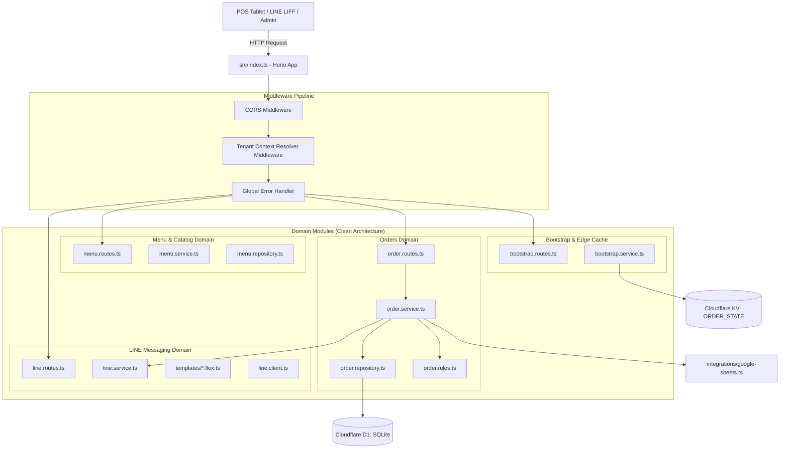

# PDP: Modular Domain Architecture & Lightweight Routing for `benmi-worker-official` [Refactor/Replace]

| Metadata | Details |
| :--- | :--- |
| **Status** | Proposed (Production Ready for Execution) |
| **Author** | Principal AI Agent & Pair Programming Partner |
| **Target Date** | 2026-09-24 |
| **Scope** | Backend Cloudflare Worker (`benmi-worker-official/src/`) |
| **Primary Constraint** | **Zero Downtime & Zero Breaking API Changes**: 100% contract compatibility with existing POS tablets (`orders.html`), LINE LIFF client (`index.html`), and LINE Webhook events. |
| **Hosting Target** | **Cloudflare Workers** (Edge Serverless + D1 SQLite + KV Cache) |

---

## 1. Executive Summary & Objectives

### 1.1 Problem Statement
The Cloudflare Worker backend ([`benmi-worker-official`](file:///Users/duccao/Documents/benmi-order-uuid-dev/benmi-worker-official)) handles all multi-tenant order processing, real-time POS queries, LINE Messaging API webhooks, menu management, and analytics. As the platform has expanded to support 1,000+ multi-tenant capabilities, the codebase has suffered severe architectural centralization:

1. **Monolithic Switchboard Router ([`src/index.ts`](file:///Users/duccao/Documents/benmi-order-uuid-dev/benmi-worker-official/src/index.ts))**:
   - 97 lines composed of over 30 sequential `if (request.method === "..." && path === "...")` checks.
   - Lacks path-parameter extraction, route grouping, typed context, and standardized middleware pipelines.
2. **Backend "God Module" ([`src/modules/orders.ts`](file:///Users/duccao/Documents/benmi-order-uuid-dev/benmi-worker-official/src/modules/orders.ts))**:
   - **1,898 lines (78 KB)** in a single file violating the Single Responsibility Principle.
   - Intertwines D1 SQL queries, order ID sequencing, customization rule validation, Google Sheets synchronization, thermal printer item chunking, and LINE Flex Message dispatching.
3. **Template & Logic Entanglement in LINE Module ([`src/modules/line.ts`](file:///Users/duccao/Documents/benmi-order-uuid-dev/benmi-worker-official/src/modules/line.ts))**:
   - **61 KB** mixing webhook signature verification, bot state machines, and hundreds of lines of raw, deeply nested LINE Flex Message JSON bubble templates.
4. **Fragile Polling Architecture & D1 Query Pressure**:
   - POS dashboards continuously execute 1.5-second HTTP polling ([`orders-core.js:1028`](file:///Users/duccao/Documents/benmi-order-uuid-dev/js/orders-core.js#L1028)).
   - When an order changes, Worker queries up to 500 rows and chunks 50 orders at a time to query `order_items` ([`order-print-items.ts:14`](file:///Users/duccao/Documents/benmi-order-uuid-dev/benmi-worker-official/src/modules/order-print-items.ts#L14)).
5. **Coding Agent Penalty**: Any modification to order cancellation, status change, or print logic requires reading and writing inside an 1,898-line file, increasing token burn and risk of regression.

### 1.2 Goals (In-Scope)
- [x] **Zero Downtime & API Contract Parity**: 100% preservation of all existing REST endpoints, status codes, JSON payload schemas, and ETag caching behavior.
- [x] **Adopt Hono Framework (< 15KB)**: Replace the manual if-else switchboard with Hono, the de-facto edge router for Cloudflare Workers, providing zero overhead, typed routing, and standardized middleware.
- [x] **Decompose `orders.ts` (1,898 lines) into Focused Domain Modules (< 350 lines/file)**: Separate into `order.routes.ts`, `order.service.ts`, `order.repository.ts`, and `order.rules.ts`.
- [x] **Decouple LINE Flex Templates from Webhook Logic**: Move raw Flex message JSON structures into dedicated template builders under `domains/line/templates/`.
- [x] **Clean Data Layer (Repository Pattern)**: Centralize all D1 SQLite queries into dedicated repositories, eliminating scattered SQL strings.
- [x] **Real-time SSE Foundation**: Lay the architectural groundwork for Server-Sent Events (`/api/orders/live-stream`) to eventually eliminate the 1.5s polling loop.

### 1.3 Non-Goals (Out-of-Scope)
- **No Database Engine Migration**: Retain Cloudflare D1 (SQLite) and Cloudflare KV (`ORDER_STATE`).
- **No Heavy ORM**: Do not install heavy ORMs like Prisma. Keep lightweight D1 prepared statements or zero-overhead query builders.
- **No Changes to POS or Client Frontend Contracts**: The frontend will not be aware of any internal backend restructuring.

---

## 2. Context & Current Architecture

### 2.1 Current File Structure & Metric
```
benmi-worker-official/src/
├── index.ts                   # 97 lines (Manual if-else dispatcher)
├── modules/
│   ├── orders.ts              # 1,898 lines (78 KB - God Module)
│   ├── line.ts                # 1,480 lines (61 KB - Webhook + Flex JSON)
│   ├── bootstrap.ts           # 650 lines (28 KB - KV Cache & Catalog)
│   ├── menu.ts                # 720 lines (31 KB - Category & Items)
│   ├── config.ts              # 180 lines (Store config & operating hours)
│   ├── auth.ts                # 120 lines (PIN & temp links)
│   ├── admin.ts               # 160 lines (Tenant provisioning)
│   ├── image.ts               # 140 lines (R2 / Image handling)
│   └── order-print-items.ts   # 24 lines (Chunked D1 query for print items)
├── integrations/
│   └── googleSheets.ts        # 110 lines (Google Sheets sync)
├── types/                     # env.ts, index.ts, tenant.ts
└── utils/                     # http.ts
```

### 2.2 Critical Pain Points
1. **Maintenance Bottleneck**: Editing `orders.ts` touches database queries, LINE messages, and Google Sheets in the same file.
2. **Testability**: Impossible to unit-test order price calculations or threshold rules without mocking the entire Cloudflare `env.DB` and execution context.
3. **Repeated Logic**: Tenant context resolution and error formatting are duplicated across multiple module entry points.

---

## 3. Proposed Architecture

### 3.1 Structural System Diagram



### 3.2 Target Directory Structure

```
benmi-worker-official/src/
├── index.ts                           # Top-level Hono app (< 50 lines)
├── middleware/
│   ├── cors.ts                        # Standardized CORS headers
│   ├── tenant.ts                      # TenantContext resolution & caching
│   └── error-handler.ts               # Structured error responses
├── domains/
│   ├── orders/
│   │   ├── order.routes.ts            # GET /api/orders, POST /api/create, POST /api/orders/append
│   │   ├── order.service.ts           # Business orchestration, status transitions
│   │   ├── order.repository.ts        # D1 queries: orders, order_items, daily_counters
│   │   ├── order.rules.ts             # Customization threshold rules validation
│   │   └── order.types.ts             # Domain DTOs and interfaces
│   ├── menu/
│   │   ├── menu.routes.ts             # GET /api/menu, POST /api/menu, POST /api/menu/stock-status
│   │   ├── menu.service.ts            # Stock status toggle, category sorting
│   │   └── menu.repository.ts         # D1 menu queries
│   ├── bootstrap/
│   │   ├── bootstrap.routes.ts        # GET /api/tenant/bootstrap
│   │   └── bootstrap.service.ts       # KV Cache read/write + invalidation
│   ├── line/
│   │   ├── line.routes.ts             # POST /webhook/:tenantId, POST /webhook
│   │   ├── line.service.ts            # Webhook state machine & event routing
│   │   ├── line.client.ts             # Push & Reply HTTP client
│   │   └── templates/                 # Decoupled LINE Flex Message JSON builders
│   │       ├── order-confirmation.flex.ts
│   │       ├── append-confirmation.flex.ts
│   │       ├── order-modified.flex.ts
│   │       └── status-change.flex.ts
│   ├── config/
│   │   ├── config.routes.ts           # GET/POST /api/config
│   │   └── config.service.ts          # Operating hours & store status
│   ├── auth/
│   │   ├── auth.routes.ts             # GET/POST /api/auth, /templink
│   │   └── auth.service.ts            # Store PIN validation
│   └── marketplace/
│       ├── marketplace.routes.ts      # GET /api/marketplace/tenants
│       └── marketplace.service.ts
├── integrations/
│   ├── google-sheets.ts               # Google Sheets async sync
│   └── printer.ts                     # Receipt print item formatting
├── types/
│   ├── env.ts                         # Worker environment bindings
│   └── tenant.ts                      # TenantContext definition
└── utils/
    ├── date.ts                        # Taiwan UTC+8 date utilities
    └── crypto.ts                      # Signature verification
```

---

## 4. Migration & Rollout Strategy

### 4.1 The Strangler Fig Pattern (Zero Downtime)
To ensure 100% safety and zero regression across live production stores:

1. **Step 1: Install Hono Dependency**:
   - Add `hono` to `benmi-worker-official/package.json` (`npm install hono`). Bundle impact: ~12 KB.
2. **Step 2: Domain-by-Domain Migration**:
   - **Phase A**: Migrate read-only / low-risk routes first (`/api/health`, `/api/marketplace`, `/api/config`).
   - **Phase B**: Migrate Bootstrap & Menu (`/api/tenant/bootstrap`, `/api/menu`).
   - **Phase C**: Migrate LINE Webhook & Templates (decouple Flex templates).
   - **Phase D**: Migrate Order Processing (`/api/create`, `/api/orders/append`, `/api/orders/modify`, `/api/orders`).
3. **Step 3: Staging Verification**:
   - Deploy to `platform-worker-staging` (`blab-db-test`).
   - Execute the automated test suite [`scripts/test-staging-orders.ts`](file:///Users/duccao/Documents/benmi-order-uuid-dev/scripts/test-staging-orders.ts).
4. **Step 4: Production Cutover**:
   - Deploy to production (`benmi-worker-official`).
   - Monitor Cloudflare Worker Invocation Logs and Error Metrics.

### 4.2 Rollback Plan
- If any unexpected error rate spike occurs (> 0.1% 500 errors), roll back to the previous deployment via Cloudflare Dashboard or `wrangler rollback` in **< 30 seconds**.

---

## 5. Alternatives Considered & Trade-offs

| Approach | Pros | Cons | Decision |
| :--- | :--- | :--- | :--- |
| **Alternative A: Status Quo (Keep `orders.ts` as God Module)** | Zero refactoring effort. | Technical debt multiplies; file will exceed 2,500 lines soon; AI agents struggle with 80KB context; high regression rate. | ❌ **Rejected** |
| **Alternative B: Heavy Framework (Nest.js / Express on Workers)** | Familiar MVC structure. | Excessive cold-start latency, bloated bundle size (> 500KB), incompatible with Workers edge runtime primitives. | ❌ **Rejected** |
| **Alternative C: Custom Manual Split (Plain functions without router)** | No new npm dependency. | Manual regex routing remains fragile; context passing is messy; lacks standard middleware. | ❌ **Rejected** |
| **Alternative D (Proposed): Hono + Domain-Driven Clean Architecture** | Ultra-light (< 15KB), sub-millisecond routing, native Cloudflare Worker support, clean Separation of Concerns (Routes -> Service -> Repository), drastically cuts AI token costs. | Requires learning Hono context APIs (`c.req.json()`, `c.json()`). | ✅ **Selected** |

---

## 6. Cross-Cutting Concerns

### 6.1 Multi-Tenancy Isolation
- Strict compliance with `AGENTS.md`: **Zero hardcoded tenant IDs**.
- Tenant context is extracted uniformly by `tenant.ts` middleware via query param (`?tenant_id=...`), header (`X-Tenant-ID`), or path parameter (`/webhook/:tenantId`).

### 6.2 Cloudflare D1 Query Efficiency
- Centralizing database queries into `order.repository.ts` allows immediate discovery and optimization of N+1 query patterns.
- Keeps prepared statements pre-compiled at the edge.

### 6.3 Observability & Structured Logging
- Enable Hono structured logger.
- Every incoming request logs `[requestId] [tenantId] [method] [path] [status] [durationMs]`.

---

## 7. Step-by-Step Execution Plan

- [ ] **Milestone 1: Project Setup & Core Middleware**:
  - [ ] Add `hono` to `package.json`.
  - [ ] Create `middleware/cors.ts`, `middleware/tenant.ts`, and `middleware/error-handler.ts`.
- [ ] **Milestone 2: LINE Flex Template Decoupling**:
  - [ ] Extract Flex Message JSON bubbles from `line.ts` into `domains/line/templates/`.
  - [ ] Isolate webhook event handling from template generation.
- [ ] **Milestone 3: Order Domain Decomposition**:
  - [ ] Create `order.repository.ts` (D1 queries for orders, items, counters).
  - [ ] Create `order.rules.ts` (Customization threshold validator).
  - [ ] Create `order.service.ts` (State transitions, math, notifications).
  - [ ] Create `order.routes.ts` (Hono endpoints).
- [ ] **Milestone 4: Menu, Config, and Bootstrap Domains**:
  - [ ] Refactor `menu.ts`, `config.ts`, and `bootstrap.ts` into domain folders.
- [ ] **Milestone 5: New `src/index.ts` Entrypoint**:
  - [ ] Mount all domain routers onto the main Hono application.
  - [ ] Verify test suite on Staging (`blab-db-test`).
  - [ ] Production deployment.

---

## 8. Verification & Test Plan

### 8.1 Automated Verification
1. Run backend build and type-checking:
   ```bash
   cd benmi-worker-official && npm run build # or npx tsc --noEmit
   ```
2. Run test suites:
   ```bash
   npm run test:order-identity
   npm run test:menu-safety
   npx tsx scripts/test-staging-orders.ts
   ```

### 8.2 End-to-End Functional Verification
1. **Order Creation (`POST /api/create`)**: Submit a test order with modifiers and bundles -> Verify D1 insertion, daily sequence increment, and ETag calculation.
2. **Order Appending (`POST /api/orders/append`)**: Append items to the order -> Verify round increment and total sum update.
3. **Order Status Lifecycle (`POST /api/update`)**: Change status from `NEW` -> `ACCEPTED` -> `DONE` -> Verify LINE push messages and Google Sheets trigger.
4. **LINE Webhook (`POST /webhook/:tenantId`)**: Send simulated webhook signature and payload -> Verify 200 OK response and bot replies.
