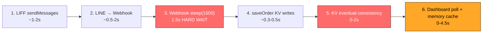
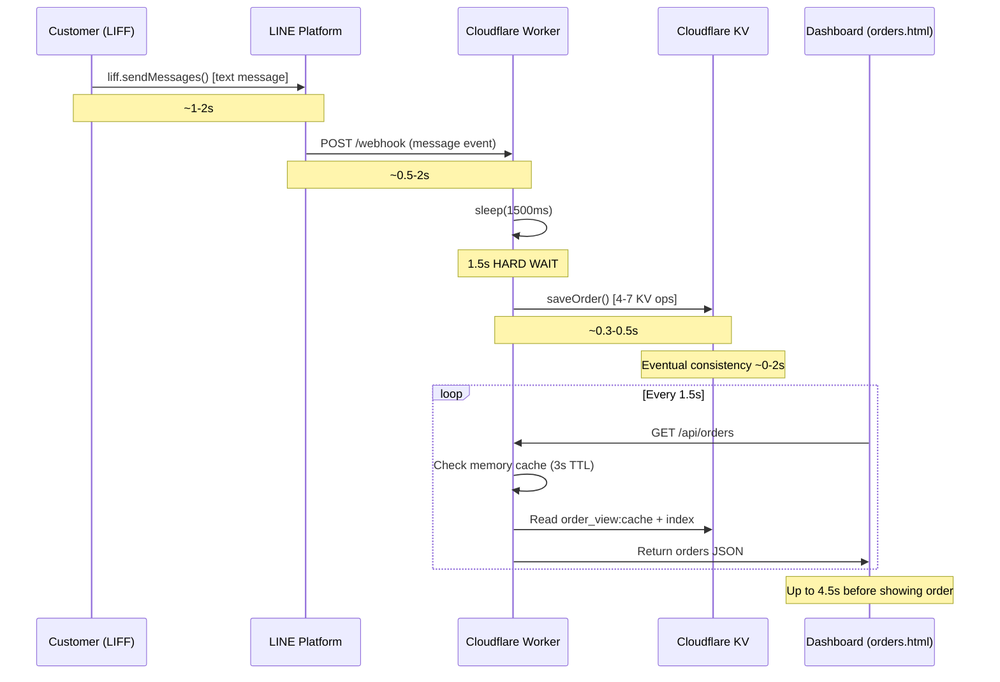
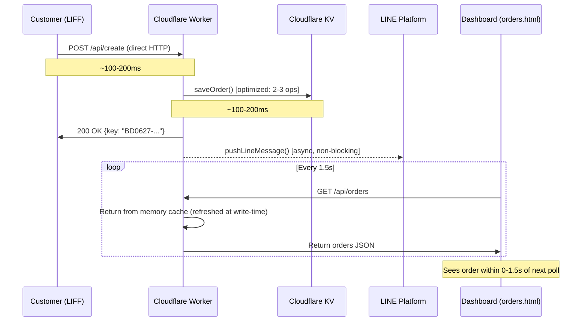

# PDP: Dashboard Order Latency Fix

*Author: Antigravity (Principal Engineer)*
*Status: Approved*
*Date: 2026-06-27*

---

## 1. Executive Summary & Objectives

### Problem Statement
When a customer submits an order through the LINE LIFF app, it takes **5–10 seconds** before the order appears on the restaurant staff dashboard ([orders.html](file:///Users/duccao/Documents/benmi-order/orders.html)). For a fast-food restaurant, this delay causes staff to miss orders, creates confusion during rush hours, and degrades the customer experience.

### Root Cause Analysis — Why 5–10 Seconds?

The latency is **not caused by a single bottleneck**, but by a chain of 6 delays that compound additively:



| # | Delay Source | Duration | Code Location |
|---|-------------|----------|---------------|
| 1 | **LIFF `sendMessages()`** — the primary path sends the order as a LINE chat message, not directly to the API | ~1–2s | [index.html:L1149](file:///Users/duccao/Documents/benmi-order/index.html#L1149) |
| 2 | **LINE Platform → Webhook delivery** — LINE queues the message and delivers it to the Cloudflare Worker webhook | ~0.5–2s | External (LINE infrastructure) |
| 3 | **Hardcoded `sleep(1500)`** — webhook deliberately waits 1.5s for a potential `/api/create` race condition | **1.5s fixed** | [worker.js:L960](file:///Users/duccao/Documents/benmi-order/benmi-worker-official/src/worker.js#L960) |
| 4 | **`saveOrder()` — 4–7 sequential KV operations** (write order, update index, read+write cache) | ~0.3–0.5s | [worker.js:L557-L636](file:///Users/duccao/Documents/benmi-order/benmi-worker-official/src/worker.js#L557-L636) |
| 5 | **Cloudflare KV eventual consistency** — writes at one edge may take seconds to propagate | 0–2s | Cloudflare infrastructure |
| 6 | **Dashboard polling interval (1.5s) + memory cache TTL (3s)** — even if data is in KV, dashboard may serve stale data | 0–4.5s | [orders.html:L1867](file:///Users/duccao/Documents/benmi-order/orders.html#L1867), [worker.js:L324](file:///Users/duccao/Documents/benmi-order/benmi-worker-official/src/worker.js#L324) |

**Worst case total: 1 + 2 + 1.5 + 0.5 + 2 + 4.5 = 11.5s** ← perfectly explains your observed 5–10s.

### Goals (In-Scope)
- [x] Reduce order-to-dashboard latency from **5–10s → under 2s**.
- [x] Zero downtime during rollout (the restaurant must keep operating).
- [x] No additional infrastructure cost (stay on Cloudflare Free Tier).

### Non-Goals (Out-of-Scope)
- [ ] Full Go/PostgreSQL migration (that's a separate effort per [go-backend-refactor.md](file:///Users/duccao/Documents/benmi-order/docs/specs/go-backend-refactor.md)).
- [ ] Changing the LINE LIFF SDK or LINE platform behavior.
- [ ] Real-time WebSocket push (requires paid infrastructure; evaluated as Alternative B below).

---

## 2. Context & Current Architecture

### Current Order Flow (Happy Path)



### Key Files
| File | Role |
|------|------|
| [index.html](file:///Users/duccao/Documents/benmi-order/index.html) | Customer LIFF ordering app |
| [orders.html](file:///Users/duccao/Documents/benmi-order/orders.html) | Staff dashboard (restaurant) |
| [worker.js](file:///Users/duccao/Documents/benmi-order/benmi-worker-official/src/worker.js) | Cloudflare Worker — API + webhook handler |
| [wrangler.jsonc](file:///Users/duccao/Documents/benmi-order/benmi-worker-official/wrangler.jsonc) | Worker configuration (single KV binding: `ORDER_STATE`) |

---

## 3. Proposed Architecture

### Overview: "API-First + Aggressive Cache Invalidation"

The core insight: **bypass the LINE message round-trip for order creation** and **eliminate the polling delay with instant cache refresh**.



### Detailed Changes (3 Layers)

---

#### Layer 1: Make `/api/create` the Primary Path (Eliminate Delays #1, #2, #3)

This is the single highest-impact change. It eliminates ~3–5.5s of the total latency in one shot.

**Current behavior**:
1. Try `liff.sendMessages()` first (sends text to LINE chat → triggers webhook)
2. Only on failure, fall back to `POST /api/create`

**Proposed behavior**: Flip the order.
1. **Always call `POST /api/create` first** (direct HTTP to Worker — ~100ms)
2. On success, use `liff.sendMessages()` as a **notification-only** message (or skip it entirely)
3. On `/api/create` failure, fall back to `liff.sendMessages()` as a backup

**Why this works**: The customer's phone makes a direct HTTPS request to the Cloudflare edge, which writes to KV immediately. No LINE platform round-trip. No webhook parsing. No `sleep(1500)`.

**Webhook dedup**: The webhook handler's `sleep(1500)` + existence check at [worker.js:L958-L966](file:///Users/duccao/Documents/benmi-order/benmi-worker-official/src/worker.js#L958-L966) already handles the case where both paths fire. When `/api/create` succeeds first, the webhook detects the existing order and skips it. We keep this safety net.

---

#### Layer 2: Optimize `saveOrder()` KV Operations (Reduce Delay #4)

**Current**: `saveOrder()` performs 4–7 sequential KV operations per call:
1. `PUT order:{key}` — write order data
2. `PUT/DELETE active_order:{userId}` — track active order
3. `GET order_index:latest` — read index
4. `PUT order_index:latest` — update index
5. `GET order_view:cache` — read dashboard cache
6. (optional) N × `GET order:{key}` — rebuild cache if empty
7. `PUT order_view:cache` — write dashboard cache

**Proposed**: Parallelize independent operations and reduce to **3 KV ops** in the fast path:

```javascript
// Parallel writes (no dependencies between them)
await Promise.all([
  env.ORDER_STATE.put(`order:${order.key}`, JSON.stringify(order)),
  order.userId
    ? (order.status === "PICKED_UP" || order.status === "REJECTED")
      ? env.ORDER_STATE.delete(`active_order:${order.userId}`)
      : env.ORDER_STATE.put(`active_order:${order.userId}`, order.key)
    : Promise.resolve()
]);

// Sequential: read-modify-write for index + cache (2 ops combined)
// ... update index and in-memory cache atomically
```

---

#### Layer 3: Make Memory Cache Authoritative on Writes (Eliminate Delay #5 and #6)

**Current issue**: After `saveOrder()`, the memory cache is updated ([worker.js:L621-L623](file:///Users/duccao/Documents/benmi-order/benmi-worker-official/src/worker.js#L621-L623)), but the next `GET /api/orders` may hit a **different Worker isolate** that still has stale memory cache (up to 3s TTL). And the dashboard only polls every 1.5s.

**Proposed fixes**:

1. **Reduce memory cache TTL from 3s → 2s**: More frequent KV reads, but tolerable within Cloudflare's free tier limits.

2. **Remain dashboard poll interval at 1.5s** (per user request).

3. **Optimistic local injection on `POST /api/create` response**: When the LIFF app calls `/api/create`, the Worker response includes the order key.

---

## 4. Migration & Rollout Strategy

Since this is a live restaurant system, we must be careful. The rollout is designed so that **if any step fails, the old behavior still works**.

### Phase 1: Backend Optimization (Zero Risk)
- Optimize `saveOrder()` parallelization and reduce memory cache TTL to 2s
- **Fully backward compatible** — no frontend changes needed
- Deploy via `wrangler deploy`

### Phase 2: Frontend API-First
- Modify [index.html](file:///Users/duccao/Documents/benmi-order/index.html) to call `/api/create` first
- Keep `liff.sendMessages()` as a receipt (Option B)
- Fallback to normal behavior on API failure

---

## 5. Alternatives Considered & Trade-offs

| Approach | Latency Target | Cost | Complexity | Risk |
|----------|---------------|------|------------|------|
| **A: API-First + Cache Optimization (Proposed)** | < 2s | Free | Low | Low |
| **B: WebSocket/SSE Push** | < 0.5s | $$$ (Durable Objects or external service) | High | Medium |
| **C: Status Quo (Do Nothing)** | 5–10s | Free | None | Business risk (missed orders) |
| **D: Full Go/PostgreSQL migration** | < 1s | $$$ (Cloud Run + DB) | Very High | High (months) |

### Why Proposed (A) wins:
- **Option B (WebSocket)** requires Cloudflare Durable Objects ($$$) or an external WebSocket service.
- **Option C (Status Quo)** is unacceptable.
- **Option D (Full Migration)** is the long-term answer, but it's months away.

---

## 6. Cross-Cutting Concerns

### Security
- No new attack surface introduced. `/api/create` already exists and is publicly accessible.

### Observability
- Add log statements to distinguish API vs Webhook source.

---

## 7. Step-by-Step Execution Plan

- [x] **Phase 1: Worker — Optimize `saveOrder()`**
  - [x] Parallelize independent KV operations with `Promise.all()`
  - [x] Reduce memory cache TTL from 3s → 2s
- [x] **Phase 2: LIFF — API-First Order Submission**
  - [x] Restructure [index.html](file:///Users/duccao/Documents/benmi-order/index.html) submit function to call `/api/create` first
  - [x] Keep `liff.sendMessages()` as non-blocking receipt
- [x] **Phase 3: Verify & Measure**
  - [x] Run syntax and diff validations.

---

## 8. Verification & Test Plan

### Manual Verification
1. Open the staff dashboard on a tablet/phone
2. Submit a test order from the LIFF app on a different phone
3. **Measure with a stopwatch**: time from "submit" button tap → order appears on dashboard
4. Expected: **< 2 seconds**
