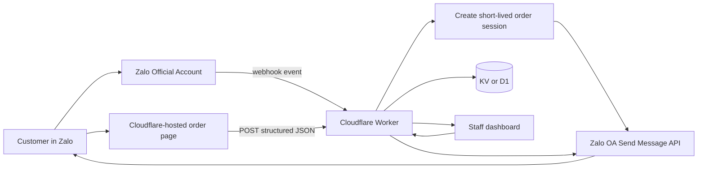
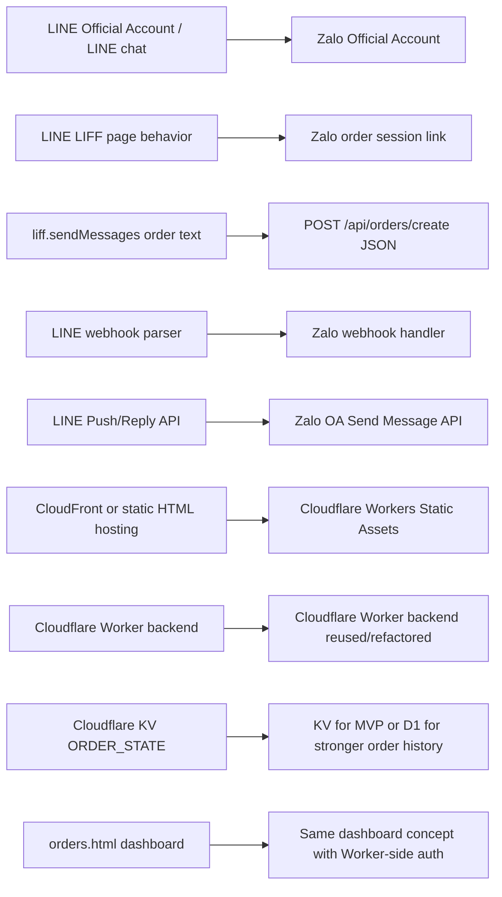
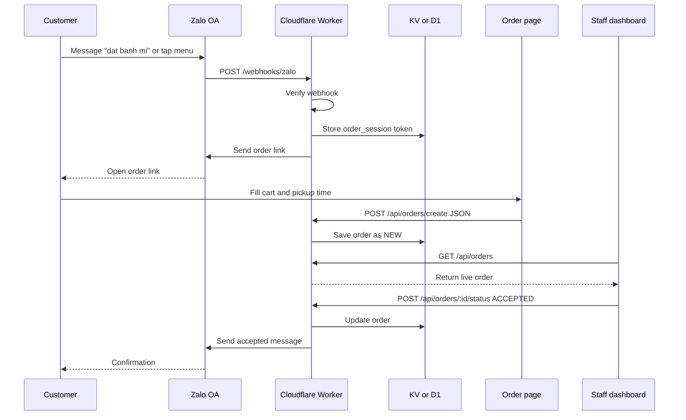
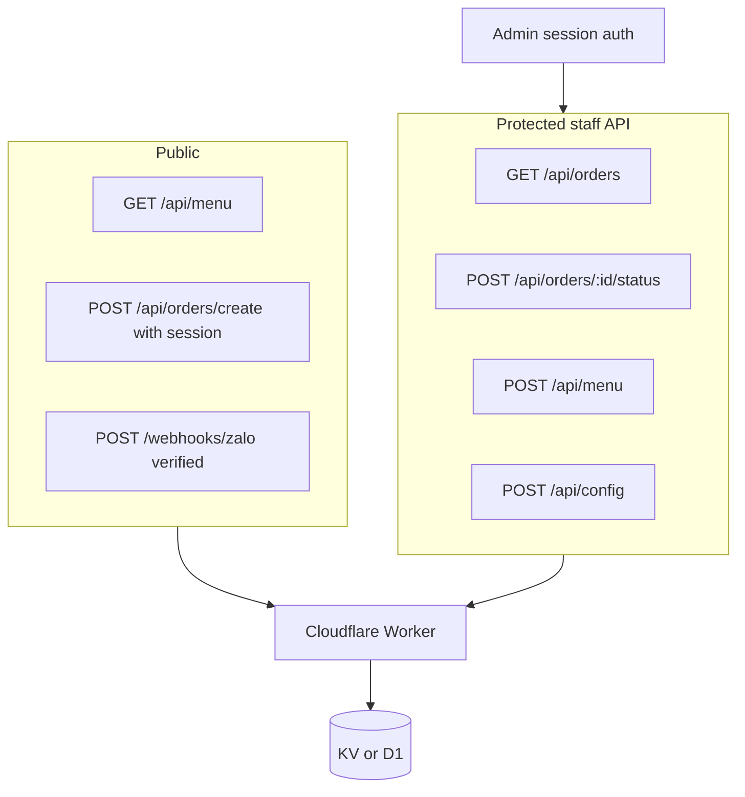
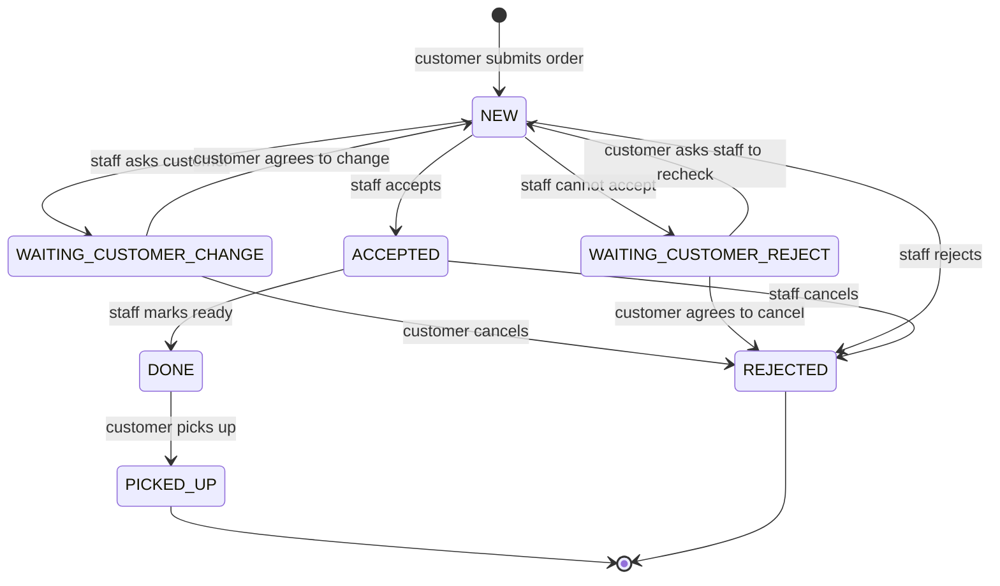

# Proposal: Rebuild Benmi Ordering With Cloudflare And Zalo

This document proposes how to build the same kind of food-ordering system, but replacing LINE with Zalo.

The goal is not to copy LINE LIFF exactly. Zalo has different product boundaries. The practical goal is to preserve the business flow:

```text
Customer starts from Zalo
  -> opens an order page
  -> submits food order
  -> staff manages order in dashboard
  -> customer receives Zalo messages for accept/change/reject
```

## Recommended Architecture

Use Cloudflare as the whole application platform:

```text
Zalo Official Account
  -> webhook events
  -> Cloudflare Worker API
  -> Cloudflare KV or D1 storage
  -> Cloudflare-hosted customer page and dashboard
  -> Zalo OA API for customer notifications
```



Recommended first version:

```text
Cloudflare Workers
Cloudflare Workers Static Assets
Cloudflare KV
Zalo Official Account OpenAPI
Zalo webhook
```

Recommended later upgrade:

```text
Replace KV order storage with D1 or Durable Objects if order volume/concurrency grows.
```

## Why This Shape

The current LINE app uses LIFF to send an order message into LINE, then the backend parses that message through a LINE webhook.

For Zalo, a cleaner and safer version is:

1. Customer messages the Zalo Official Account or taps a menu/link.
2. Zalo sends a webhook to the Cloudflare Worker.
3. Worker creates a short-lived signed order session token.
4. Worker replies with an order link:

```text
https://order.example.com/?session=<short-lived-token>
```

5. Customer opens the Cloudflare-hosted order page.
6. Customer submits the cart directly to the Worker:

```text
POST /api/orders/create
```

7. Worker resolves the session token back to the Zalo user ID and stores the order.
8. Staff dashboard sees the order.
9. Staff actions trigger Zalo OA API messages back to the customer.

This avoids relying on the browser page to send a message back into Zalo in the same way LIFF does. It also makes the order payload structured JSON instead of text parsing.

## Zalo Products Needed

### Zalo Official Account

Zalo OA is the business account customers interact with. It supports messaging and OpenAPI integrations for business systems.

Official Zalo OA OpenAPI overview: https://oa.zaloapp.com/home/function/extension?type=open-api

Official Zalo OA interaction overview: https://oa.zaloapp.com/home/function/interaction

### Zalo Developer App

You will need a Zalo developer app connected to the Official Account. This is where webhook configuration, credentials, and API permissions are managed.

Typical required values:

```text
ZALO_APP_ID
ZALO_APP_SECRET
ZALO_OA_ACCESS_TOKEN
ZALO_OA_REFRESH_TOKEN
ZALO_WEBHOOK_SECRET or verification settings, if provided by Zalo
```

The exact token flow and webhook validation details should be confirmed from the Zalo Developer dashboard/docs when implementing. Do not trust webhook payloads without verification.

### Zalo Webhook

The webhook is how Zalo notifies the backend when a customer sends a message or interacts with the OA.

The Worker should expose:

```text
POST /webhooks/zalo
```

The webhook handler should:

- Validate the webhook signature or verification mechanism supported by Zalo.
- Parse incoming message event.
- Extract Zalo user ID.
- Detect order intent.
- Create a short-lived order session.
- Send the customer an order link.

## Cloudflare Products Needed

### Workers

Use a Worker as the backend API and webhook handler.

Official docs: https://developers.cloudflare.com/workers/

Responsibilities:

- Zalo webhook receiver.
- Customer order API.
- Staff dashboard API.
- Menu/config API.
- Zalo message sending.
- Auth checks.
- Storage access.

### Wrangler

Use Wrangler for local development and deployment.

Official docs: https://developers.cloudflare.com/workers/wrangler/

Basic commands:

```bash
npm install
npx wrangler dev
npx wrangler deploy
```

### Workers Static Assets

Use Cloudflare Workers Static Assets to host the customer ordering page and staff dashboard together with the Worker.

Official docs: https://developers.cloudflare.com/workers/static-assets/

That removes the need for CloudFront/S3 unless you have another reason to keep them.

Suggested structure:

```text
benmi-zalo/
  public/
    index.html
    orders.html
  src/
    worker.js
  wrangler.jsonc
  package.json
```

Suggested config shape:

```jsonc
{
  "name": "benmi-zalo",
  "main": "src/worker.js",
  "compatibility_date": "2026-05-03",
  "assets": {
    "directory": "./public",
    "binding": "ASSETS"
  },
  "kv_namespaces": [
    {
      "binding": "ORDER_STATE",
      "id": "..."
    }
  ]
}
```

### KV Or D1

For an MVP, KV is acceptable for:

- Menu.
- Store config.
- Short-lived sessions.
- Small order lists.
- Pending customer replies.

Official KV docs: https://developers.cloudflare.com/kv/

For production order history, D1 is a better long-term database because orders are relational and need stronger query behavior.

Suggested pragmatic path:

```text
Phase 1: KV, close to current project.
Phase 2: D1 for orders, KV for sessions/config/cache.
```

## Current System To New System Mapping

This section shows which current part is replaced by which new part.



| Current system part | New Zalo system part | What changes |
| --- | --- | --- |
| LINE Official Account / LINE chat | Zalo Official Account | Customers interact with the business through Zalo instead of LINE. |
| LINE LIFF ID and LIFF SDK | Zalo-triggered signed order link | Zalo does not need to mimic LIFF. The Worker sends a short-lived order URL to the customer. |
| `index.html` inside LINE | Cloudflare-hosted `index.html` or new order page | The customer page can mostly stay, but it should submit JSON directly to the Worker. |
| `liff.sendMessages()` | `POST /api/orders/create` | Replace chat-text order submission with structured JSON order creation. This is safer and easier to validate. |
| LINE webhook at `POST /webhook` | Zalo webhook at `POST /webhooks/zalo` | Replace LINE event parsing with Zalo event parsing and Zalo webhook verification. |
| Parsing order text from LINE messages | Validating structured order JSON | Avoid brittle string parsing for order content, total, notes, and pickup time. |
| LINE user ID | Zalo user ID | Store Zalo customer identity on the order instead of LINE `userId`. |
| LINE Push/Reply API | Zalo OA message API | Staff actions still notify customers, but through Zalo OA APIs. |
| `orders.html` staff dashboard | Same dashboard concept | The UI can be reused, but APIs should be cleaned up and protected by Worker-side auth. |
| `/api/update` status API | `/api/orders/:id/status` | Same business action, clearer endpoint design. |
| `/api/menu` and `/api/config` | Same endpoints or versioned equivalents | Keep these concepts, but protect write access. |
| Cloudflare Worker | Cloudflare Worker | Keep this. Refactor it into clearer modules for auth, orders, storage, Zalo messaging, and webhooks. |
| Cloudflare KV `ORDER_STATE` | KV first, D1 later if needed | KV is fine for MVP. D1 is better for durable order history/reporting. |
| CloudFront/static hosting, if currently used | Cloudflare Workers Static Assets | Optional but recommended so frontend and backend deploy together. |
| Google Sheets sync | Keep or replace with D1/reporting | Keep only if staff need spreadsheet workflows. Otherwise app-native history is cleaner. |
| OpenRouter AI intent detection | Optional Zalo intent detection | Keep optional. The core order path should not depend on AI. |

The biggest conceptual replacement is this:

```text
Current:
Order page creates text -> LINE sends text -> Worker parses text

New:
Order page creates JSON -> Worker validates JSON -> Worker stores order
```

Everything else is mostly adapter work around that core change.

## Proposed Request Flow



### Customer Starts Ordering From Zalo

```text
Customer sends "đặt bánh mì" to Zalo OA
  -> Zalo calls POST /webhooks/zalo
  -> Worker verifies webhook
  -> Worker gets zaloUserId
  -> Worker stores order_session:<token> = zaloUserId
  -> Worker sends Zalo message with order URL
```

Order URL:

```text
https://order.example.com/?session=<token>
```

Session token rules:

- Random and unguessable.
- Expires quickly, for example 30 minutes.
- One-time use if possible.
- Stored in KV:

```text
order_session:<token> -> { zaloUserId, createdAt }
```

### Customer Submits Order

```text
Browser submits POST /api/orders/create
  -> Worker validates session token
  -> Worker validates cart/date/time
  -> Worker creates order
  -> Worker stores order as NEW
  -> Worker optionally sends confirmation via Zalo
```

Payload should be structured JSON, not text:

```json
{
  "session": "abc123",
  "pickupTime": "2026-05-03 12:30",
  "items": [
    {
      "category": "small",
      "name": "烤肉",
      "quantity": 1,
      "customizations": [
        {
          "spicy": "微辣",
          "topping": "起司",
          "note": ""
        }
      ]
    }
  ],
  "note": "no coriander"
}
```

### Staff Accepts Order

```text
Dashboard POST /api/orders/:id/status ACCEPTED
  -> Worker updates order
  -> Worker sends Zalo OA message to customer
```

### Staff Requests Change

```text
Dashboard asks to change time/item
  -> Worker stores pending:<zaloUserId>
  -> Worker sends Zalo message asking customer
  -> Customer replies in Zalo
  -> Zalo webhook reaches Worker
  -> Worker matches pending state
  -> Worker updates order
```

## Suggested API Design

Use explicit versioned routes:

```text
GET  /api/menu
POST /api/menu
GET  /api/config
POST /api/config

POST /api/orders/create
GET  /api/orders
GET  /api/orders/:id
POST /api/orders/:id/status

POST /webhooks/zalo

POST /api/admin/login
POST /api/admin/logout
GET  /api/admin/me
```

Do not expose write APIs without auth.



## Suggested Data Model

### Order

```json
{
  "id": "B0503-1230-4567",
  "platform": "zalo",
  "customer": {
    "zaloUserId": "...",
    "displayName": "..."
  },
  "status": "NEW",
  "pickupTime": "2026-05-03 12:30",
  "items": [],
  "subtotal": 160,
  "note": "",
  "createdAt": 1770000000000,
  "updatedAt": 1770000000000
}
```

### Statuses

Use the same lifecycle as the current app:

```text
NEW
ACCEPTED
DONE
PICKED_UP
WAITING_CUSTOMER_CHANGE
WAITING_CUSTOMER_REJECT
REJECTED
```



### Session

```json
{
  "token": "random",
  "zaloUserId": "...",
  "createdAt": 1770000000000,
  "expiresAt": 1770001800000,
  "usedAt": null
}
```

## Admin Auth Requirement

This should be fixed from the start.

Minimum acceptable approach:

- Password login.
- Secure HTTP-only session cookie.
- Worker-side auth middleware protecting every write route.
- No default password.
- Rate limit login attempts.
- Store password hash, not plaintext password.

Protected routes:

```text
POST /api/menu
POST /api/config
POST /api/orders/:id/status
GET  /api/orders
```

For real production, consider Cloudflare Access in front of the dashboard if staff can use email-based login.

## Webhook Security Requirement

Do not repeat the current LINE webhook weakness.

The Zalo webhook handler must verify that the request really came from Zalo using whatever verification mechanism Zalo provides for the app/OA webhook. If Zalo gives a signature/header/app secret validation flow, implement it before processing the event.

Rules:

- Reject invalid webhook requests.
- Log minimal metadata only.
- Never trust `user_id`, message text, or event type until verification passes.
- Store raw webhook event IDs if Zalo provides them, so duplicate events can be ignored.

## Zalo Messaging Adapter

Create a small abstraction instead of scattering Zalo API calls through the app:

```js
class MessagingAdapter {
  sendText(userId, text) {}
  sendOrderLink(userId, url) {}
  sendChangeRequest(userId, order, reason) {}
  sendCancelNotice(userId, order, reason) {}
}
```

Then implement:

```text
LineMessagingAdapter
ZaloMessagingAdapter
```

This lets you keep most order/dashboard logic platform-independent.

## Migration Approach From Current Code

### Phase 1: Document And Stabilize Current Worker

- Add Worker-side auth.
- Add webhook signature verification for LINE.
- Move hardcoded secrets/URLs to Cloudflare secrets.
- Keep current UI.

### Phase 2: Refactor Backend Into Platform-Neutral Core

Split `worker.js` conceptually into:

```text
router
auth
orders
menu
config
storage
messaging/line
messaging/zalo
webhooks/line
webhooks/zalo
```

### Phase 3: Build Zalo MVP

- Create Zalo OA and developer app.
- Configure `POST /webhooks/zalo`.
- Implement Zalo webhook verification.
- Implement Zalo message sending.
- Implement signed order-session links.
- Reuse menu/order/dashboard UI.

### Phase 4: Move Hosting Fully To Cloudflare

- Put `index.html` and `orders.html` under `public/`.
- Configure Workers Static Assets.
- Deploy frontend and backend together.

### Phase 5: Improve Database

If orders become important for accounting/history, move from KV to D1:

- `orders`
- `order_items`
- `order_events`
- `customers`
- `menu_items`

## Proposed Cloudflare Secrets

```text
ZALO_APP_ID
ZALO_APP_SECRET
ZALO_OA_ACCESS_TOKEN
ZALO_OA_REFRESH_TOKEN
ZALO_WEBHOOK_SECRET
ADMIN_SESSION_SECRET
OPENROUTER_API_KEY
GOOGLE_SHEETS_URL
```

Set them with:

```bash
npx wrangler secret put ZALO_APP_SECRET
npx wrangler secret put ZALO_OA_ACCESS_TOKEN
npx wrangler secret put ADMIN_SESSION_SECRET
```

## Main Technical Decisions

### Use Direct JSON Order Creation

Prefer this:

```text
Order page -> POST JSON -> Worker
```

Instead of this:

```text
Order page -> creates text -> chat platform -> webhook -> parse text
```

Text parsing is fragile. Structured JSON is easier to validate, test, and migrate.

### Keep Zalo-Specific Logic At The Edge

Only webhook and message-send code should know about Zalo.

The core order logic should not care whether the customer came from LINE, Zalo, WhatsApp, or a normal website.

### Start With KV, Plan For D1

KV is fast to build with. D1 is better for durable order history and reporting. Do not over-engineer day one, but do not pretend KV is a full relational database.

## MVP Checklist

- Cloudflare Worker project created.
- Static Assets configured for customer page and dashboard.
- KV namespace created and bound.
- Zalo OA created.
- Zalo app created and linked to OA.
- Zalo webhook URL configured.
- Zalo webhook verification implemented.
- Zalo send-message API implemented.
- Customer order session token implemented.
- Customer JSON order creation implemented.
- Staff dashboard protected by auth.
- Menu/config write APIs protected by auth.
- Worker deployed with Wrangler.
- Test order completed end-to-end from Zalo.

## Open Questions Before Build

- Does your Zalo OA have permission to send the required types of messages?
- Does Zalo require business verification/review for the APIs you need?
- What webhook verification mechanism is available for your app/OA?
- Do customers need a Zalo Mini App experience, or is a normal mobile web order page enough?
- Should the dashboard be accessible only from shop devices or from any browser?
- Is Google Sheets still needed, or should order history live only in the app?

## Recommended First Build

Build a Cloudflare-only MVP:

```text
Worker + Static Assets + KV + Zalo OA webhook + signed order links
```

This gives you the same business behavior as the current LINE app while reducing the fragile part of the old design: parsing order text from chat messages.
