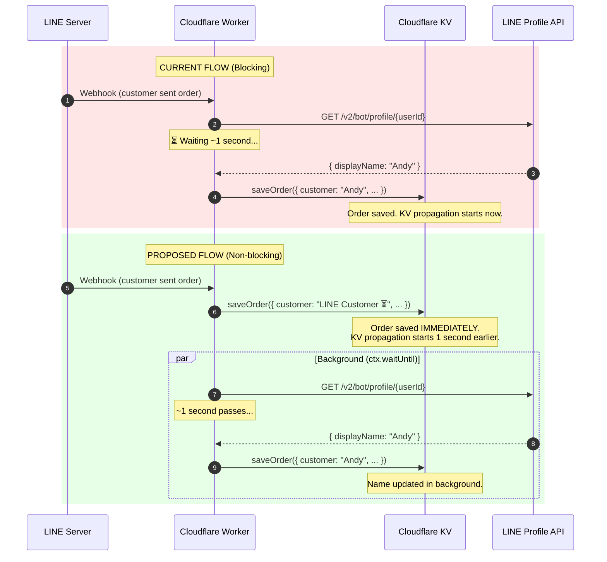
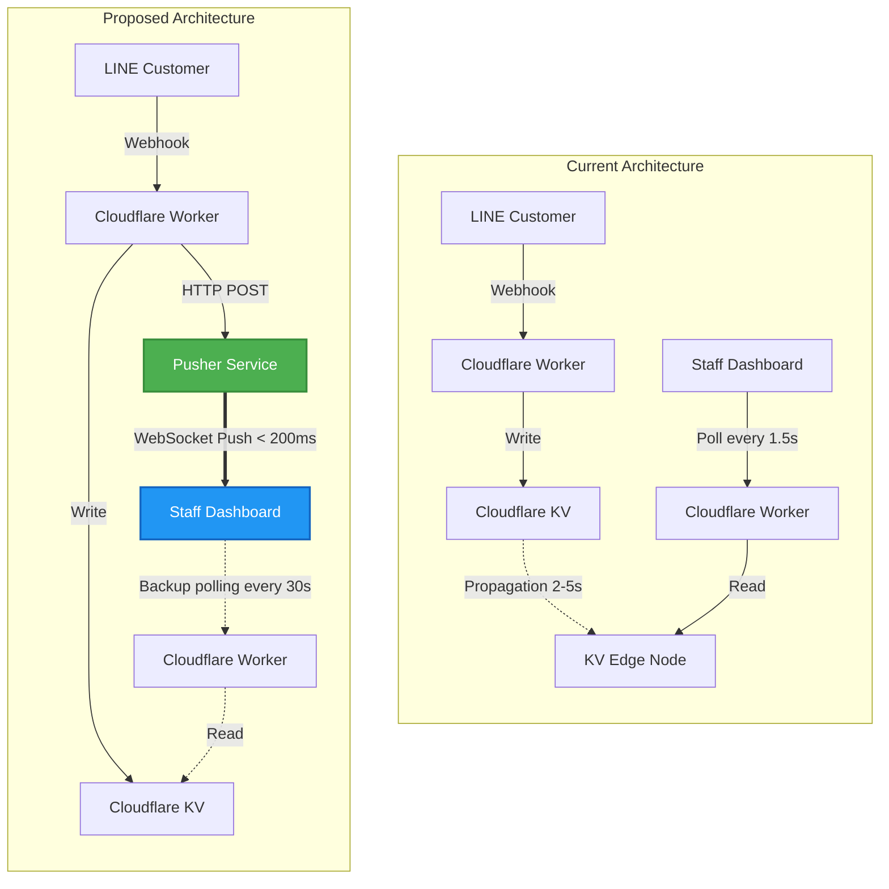

# Staff Dashboard Latency: Technical Improvement Plans

---

## How the Cloudflare Free Plan Works

Before diving into the plans, here is a reference of all the quotas and limitations relevant to this system on the **Cloudflare Workers Free Plan**.

### Workers Runtime

| Resource | Free Plan Limit | Notes |
|:---------|:----------------|:------|
| Requests | **100,000 / day** | Resets at midnight UTC. Includes all HTTP requests to the Worker (polling, webhooks, API calls). |
| CPU Time | **10 ms / invocation** | Active JavaScript execution time per request. Does NOT include time spent waiting for network I/O (`fetch`, KV reads). Exceeding this returns a `1102` error. |
| Worker Size | **1 MB** after compression | Total script size including dependencies. |
| Subrequests (`fetch`) | **50 / invocation** | Max outbound HTTP requests per single Worker invocation (e.g., LINE API, Google Sheets, OpenRouter). |
| Cron Triggers | **5 triggers** | Scheduled invocations. Not currently used by Benmi. |

### Workers KV (Key-Value Database)

| Resource | Free Plan Limit | Notes |
|:---------|:----------------|:------|
| **Read operations** | **100,000 / day** | Each `env.ORDER_STATE.get(...)` call = 1 read. |
| **Write operations** | **1,000 / day** | Each `env.ORDER_STATE.put(...)` or `.delete(...)` call = 1 write. |
| **Delete operations** | **1,000 / day** | Shares the write quota. |
| **List operations** | **1,000 / day** | `env.ORDER_STATE.list(...)`. Not used by Benmi (uses manual index instead). |
| **Storage** | **1 GB total** | Total data stored across all keys. |
| **Max value size** | **25 MB** | Per key. Benmi stores images as base64 (~5 MB max). |
| **Consistency Model** | **Eventually Consistent** | Writes propagate globally within **~60 seconds** (typically 2–5 seconds). A read immediately after a write **on a different edge node** may return stale data. |

> [!IMPORTANT]
> **KV Eventual Consistency** is the core reason orders take 4–5 seconds to appear on the staff dashboard. When the Worker writes an order to KV, it is written to the nearest Cloudflare edge node (e.g., Taipei). But the staff dashboard's polling request may be routed to a different edge node (e.g., Tokyo or Hong Kong), which hasn't received the update yet. Cloudflare must propagate the write across its global network first.

### Cloudflare Pages (Static Hosting)

| Resource | Free Plan Limit | Notes |
|:---------|:----------------|:------|
| Requests | **Unlimited** | Serving static HTML/CSS/JS files has no request limits. |
| Bandwidth | **Unlimited** | No bandwidth caps on static assets. |
| Builds | **500 / month** | Deployments via Git or CLI. |

> [!NOTE]
> The staff dashboard (`orders.html`) and customer ordering page (`index.html`) are hosted on Cloudflare Pages for free with no limits. The cost comes entirely from the **Worker** and **KV** when the dashboard's JavaScript makes API calls.

---

## Plan 1: Move Profile Fetch to Background (`ctx.waitUntil`)

### What is the Problem?

In the LINE webhook handler (`worker.js` lines 746-777), when a customer sends an order via LINE chat, the Worker fetches the customer's LINE profile name **before** saving the order to KV:

```javascript
// worker.js — Current Code (Lines 746-777)

// Step 1: Fetch profile (BLOCKS for ~1 second)
let custName = "Khách (Web)";
try {
  const token = env.LINE_CHANNEL_TOKEN;
  const profUrl = `https://api.line.me/v2/bot/profile/${userId}`;
  const resp = await fetch(profUrl, { ... });  // ← Blocks here for ~1s
  if (resp.ok) {
    const p = await resp.json();
    if (p && p.displayName) custName = p.displayName;
  }
} catch (e) { }

// Step 2: Save order (only runs AFTER profile fetch completes)
const orderData = {
  key: orderKey,
  customer: custName,  // ← Uses the fetched name
  ...
};

await saveOrder(env, orderData);  // ← KV write happens 1 second late
```

This means the order is not written to KV until **~1 second after** the webhook arrives. The staff dashboard cannot see it until KV propagates this delayed write.

### What Does the Fix Do?

Reverse the order: save the order to KV **first** with a temporary placeholder name, then fetch the real name in the background and update the record.

### Before vs. After Flow



### What the Staff Sees on the Dashboard

```
Timeline (seconds after customer submits order):
─────────────────────────────────────────────────────

  0s        3s        4s        6s        8s
  │         │         │         │         │
  ▼         ▼         ▼         ▼         ▼

CURRENT:   (nothing)  (nothing)  Order appears
                                 Customer: "Andy"

PROPOSED:  (nothing)  Order appears              Name updates
                      Customer: "LINE Customer ⏳" Customer: "Andy"
```

### Exact Code Change Required

#### File: `benmi-worker-official/src/worker.js`

```diff
     // Inside handleLineWebhook, the LIFF text order parsing block:

-    let custName = "Khách (Web)";
-    try {
-      const token = env.LINE_CHANNEL_TOKEN;
-      const profUrl = `https://api.line.me/v2/bot/profile/${userId}`;
-      const resp = await fetch(profUrl, { headers: { Authorization: `Bearer ${token}` } });
-      if (resp.ok) {
-        const p = await resp.json();
-        if (p && p.displayName) custName = p.displayName;
-      }
-    } catch (e) { }
+    let custName = "LINE Customer ⏳";

     // ... (content extraction code stays the same) ...

     const orderData = { key: orderKey, customer: custName, ... };

     await saveOrder(env, orderData);

+    // Fetch real LINE name in background and update KV
+    if (ctx && ctx.waitUntil) {
+      ctx.waitUntil((async () => {
+        try {
+          const token = env.LINE_CHANNEL_TOKEN;
+          const profUrl = `https://api.line.me/v2/bot/profile/${userId}`;
+          const resp = await fetch(profUrl, { headers: { Authorization: `Bearer ${token}` } });
+          if (resp.ok) {
+            const p = await resp.json();
+            if (p && p.displayName) {
+              orderData.customer = p.displayName;
+              await saveOrder(env, orderData);
+            }
+          }
+        } catch (e) {
+          console.error("Background profile fetch failed:", e);
+        }
+      })());
+    }
```

### Risk Analysis

| Concern | Risk Level | Explanation |
|:--------|:-----------|:------------|
| Order data loss | ❌ None | The order is saved to KV **before** the background task starts. If `ctx.waitUntil` fails, the order is still safely stored. |
| Name never updates | ⚠️ Very Low | If the LINE Profile API is down, the name stays as `"LINE Customer ⏳"`. Staff can still identify the customer by order content and pickup time. The name will NOT auto-retry, but this scenario is extremely rare. |
| Extra KV writes | ⚠️ Low | The background task calls `saveOrder` a second time to update the name, consuming **3 additional KV write operations**. On the Free plan (1,000 writes/day), this is acceptable unless you process 100+ LINE webhook orders per day. |
| Business logic impact | ❌ None | No order flow, status transitions, or customer notifications are affected. Only the timing of when the display name appears changes. |

### Estimated Improvement

**~1 second faster** for orders arriving via the LINE webhook path. The order reaches KV 1 second earlier, which means the dashboard sees it 1 second sooner after KV propagation completes.

---

## Plan 2: Real-Time Push via Pusher WebSocket

### Why is This Plan Needed?

After implementing Plan 1, the remaining 3–4 seconds of delay is caused by **KV eventual consistency** — a fundamental architectural property of Cloudflare KV that cannot be fixed with code changes. The only way to bypass it is to send the order data directly to the dashboard over a separate real-time channel.

### What is Pusher?

**Pusher Channels** is a hosted WebSocket service. It provides:
- A **server-side HTTP API** that the Worker uses to broadcast events (e.g., "new order arrived").
- A **client-side JavaScript SDK** that the dashboard uses to receive those events instantly over a persistent WebSocket connection.

The Worker does NOT need to maintain a WebSocket server. It simply sends a standard HTTP POST to Pusher's API, and Pusher handles the real-time delivery.

### Pusher Free Tier Limits

| Resource | Free Plan Limit | Benmi Usage Estimate |
|:---------|:----------------|:---------------------|
| Connections | **200 concurrent** | 1–3 (staff devices) |
| Messages | **200,000 / day** | ~100–500 (order events) |
| Channels | **100** | 1 (`orders-channel`) |
| Message Size | **10 KB** | ~0.5 KB per order |
| Cost | **$0 / month** | Free tier is more than enough |

### Architecture Overview



> [!NOTE]
> Polling is NOT removed. It is kept as a **backup** at a much slower interval (e.g., every 30 seconds) in case the WebSocket connection drops. This ensures the system is never fully dependent on Pusher.

### Implementation Details

#### Step 1: Create a Pusher Account
1. Go to [pusher.com](https://pusher.com) → Sign up (free).
2. Create a new **Channels** app.
3. Note down: `app_id`, `key`, `secret`, `cluster`.

#### Step 2: Add Pusher Secrets to Cloudflare Worker
Add these as environment variables (secrets) in Cloudflare dashboard or `wrangler.jsonc`:

```
PUSHER_APP_ID = "your_app_id"
PUSHER_KEY = "your_key"
PUSHER_SECRET = "your_secret"
PUSHER_CLUSTER = "ap1"   (for Asia)
```

#### Step 3: Worker-Side — Broadcast on Order Save

Add a helper function to the Worker that sends events to Pusher. Pusher's API requires HMAC-SHA256 authentication, which Cloudflare Workers support natively via the Web Crypto API.

```javascript
// New function in worker.js
async function pushToPusher(eventName, orderData, env) {
  if (!env.PUSHER_APP_ID || !env.PUSHER_KEY || !env.PUSHER_SECRET) return;

  const cluster = env.PUSHER_CLUSTER || "ap1";
  const channel = "orders-channel";
  const data = JSON.stringify(orderData);

  const timestamp = Math.floor(Date.now() / 1000);
  const body = JSON.stringify({
    name: eventName,
    channel: channel,
    data: data
  });

  const md5Hash = await crypto.subtle.digest("MD5", new TextEncoder().encode(body));
  const bodyMd5 = Array.from(new Uint8Array(md5Hash)).map(b => b.toString(16).padStart(2, '0')).join('');

  const path = `/apps/${env.PUSHER_APP_ID}/events`;
  const queryString = [
    `auth_key=${env.PUSHER_KEY}`,
    `auth_timestamp=${timestamp}`,
    `auth_version=1.0`,
    `body_md5=${bodyMd5}`
  ].sort().join("&");

  const signString = `POST\n${path}\n${queryString}`;
  const key = await crypto.subtle.importKey(
    "raw", new TextEncoder().encode(env.PUSHER_SECRET),
    { name: "HMAC", hash: "SHA-256" }, false, ["sign"]
  );
  const sig = await crypto.subtle.sign("HMAC", key, new TextEncoder().encode(signString));
  const authSignature = Array.from(new Uint8Array(sig)).map(b => b.toString(16).padStart(2, '0')).join('');

  const url = `https://api-${cluster}.pusher.com${path}?${queryString}&auth_signature=${authSignature}`;

  await fetch(url, {
    method: "POST",
    headers: { "Content-Type": "application/json" },
    body: body
  });
}
```

Then, in `saveOrder`, add a background broadcast after writing to KV:

```javascript
async function saveOrder(env, order, ctx) {
  // ... existing KV write logic ...

  // Broadcast to dashboard via Pusher (non-blocking)
  if (ctx && ctx.waitUntil) {
    ctx.waitUntil(pushToPusher("order-update", order, env));
  }
}
```

#### Step 4: Dashboard-Side — Listen for WebSocket Events

Add the Pusher client SDK and subscribe to events in `orders.html`:

```html
<!-- Add before </body> -->
<script src="https://js.pusher.com/8.0/pusher.min.js"></script>
<script>
  // Initialize Pusher connection
  const pusher = new Pusher("YOUR_PUSHER_KEY", {
    cluster: "ap1"
  });

  const channel = pusher.subscribe("orders-channel");

  // Listen for real-time order updates
  channel.bind("order-update", function (order) {
    if (!order || !order.key) return;

    // Merge the incoming order into the local orders list
    const idx = latestOrders.findIndex(o => o.key === order.key);
    if (idx >= 0) {
      latestOrders[idx] = order;
    } else {
      latestOrders.unshift(order);
      // Trigger new order alarm if it's a NEW order
      if (order.status === "NEW") {
        knownOrderKeys.add(order.key);
        pendingNewOrders = latestOrders.filter(o => o && o.status === "NEW");
        startContinuousAlarm();
        updateNewAlert();
      }
    }

    renderAll();
  });
</script>
```

Then reduce the backup polling interval from 1.5 seconds to 30 seconds:

```javascript
setInterval(() => {
  if (activeTab === "live" || activeTab === "history") fetchOrders();
}, 30000); // 30 seconds backup poll (down from 1.5s)
```

### Risk Analysis

| Concern | Risk Level | Explanation |
|:--------|:-----------|:------------|
| Pusher goes down | ❌ None | Backup polling (every 30s) ensures the dashboard still receives orders. Worst case: 30-second delay instead of instant. |
| Security (order data exposed) | ⚠️ Low | Pusher channels are public by default. Order data (customer name, items, time) is not highly sensitive. For extra security, Pusher supports **private channels** with token-based auth. |
| Extra Worker subrequests | ⚠️ Low | Each order event adds 1 outbound `fetch` call (to Pusher API). Free plan allows 50 subrequests per invocation — this is well within limits. |
| Free tier exceeded | ❌ None | Benmi would need 200,000+ order events per day to exceed Pusher's free tier. Current volume is estimated at 100–500 events/day. |
| Added complexity | ⚠️ Medium | Introduces a third-party dependency. However, the fallback polling ensures the system works independently of Pusher. |

### Estimated Improvement

**Orders appear on the staff dashboard in under 0.5 seconds** (down from 4–5 seconds). The WebSocket push bypasses both the KV propagation delay and the polling interval entirely.

---

## Combined Impact Summary

```mermaid
gantt
    title Staff Dashboard: Time Until Order Appears
    dateFormat X
    axisFormat %ss

    section Current System
    Profile fetch blocks KV write   :a1, 0, 1s
    KV propagation delay            :a2, after a1, 3s
    Polling alignment               :a3, after a2, 1s

    section After Plan 1 Only
    KV propagation delay            :b1, 0, 3s
    Polling alignment               :b2, after b1, 1s

    section After Plan 1 + Plan 2
    Pusher WebSocket push           :c1, 0, 0.3s
```



| Configuration | Dashboard Delay | KV Reads / Day (1 tab) |
|:-------------|:----------------|:----------------------|
| **Current** | 4–5 seconds | 57,600 |
| **Plan 1 only** | 3–4 seconds | 57,600 (unchanged) |
| **Plan 1 + Plan 2** | **< 0.5 seconds** | **2,880** (30s polling backup) |
